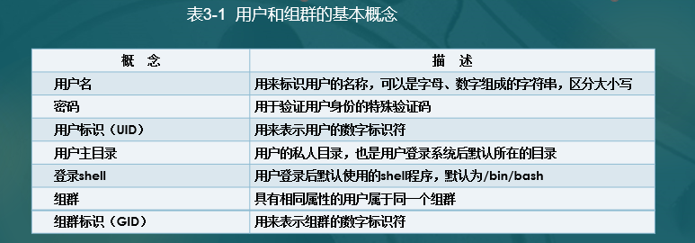
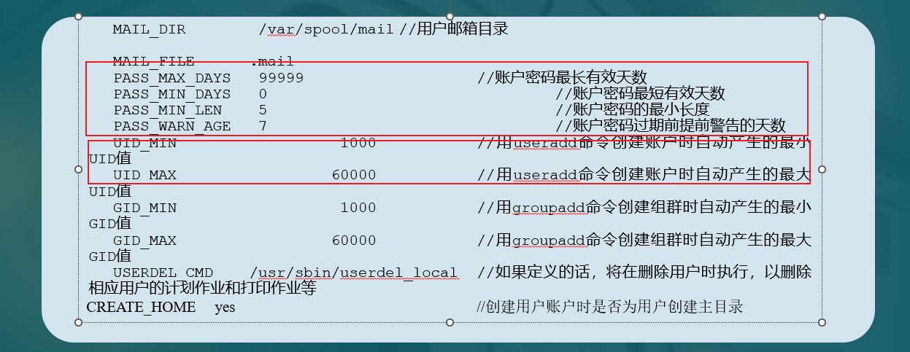
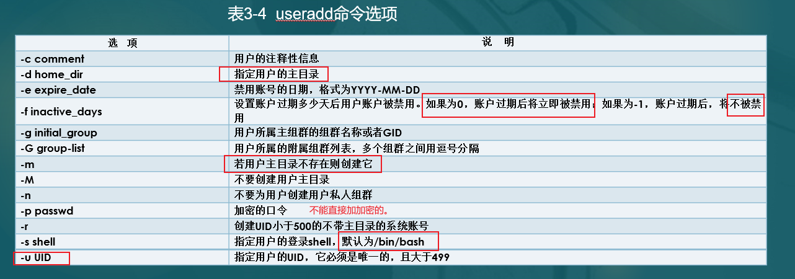
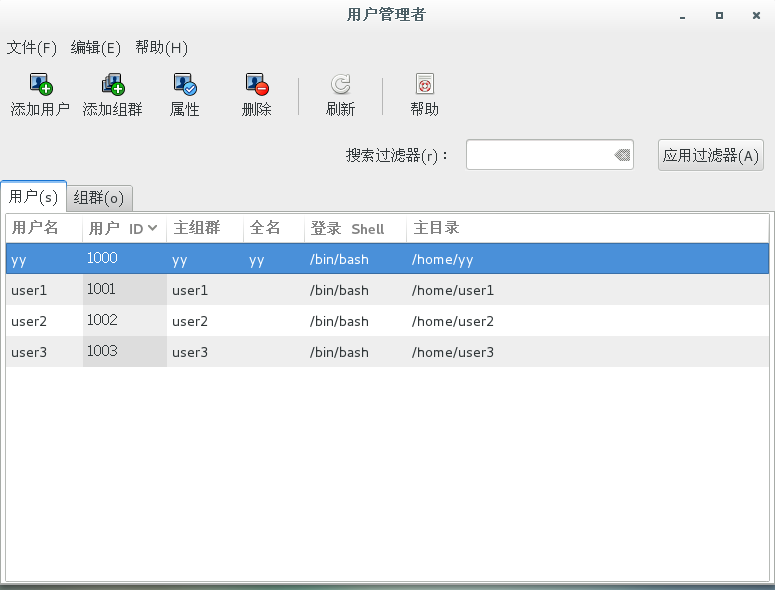
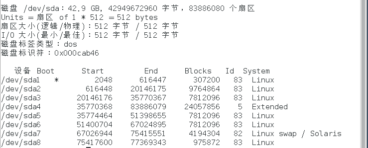
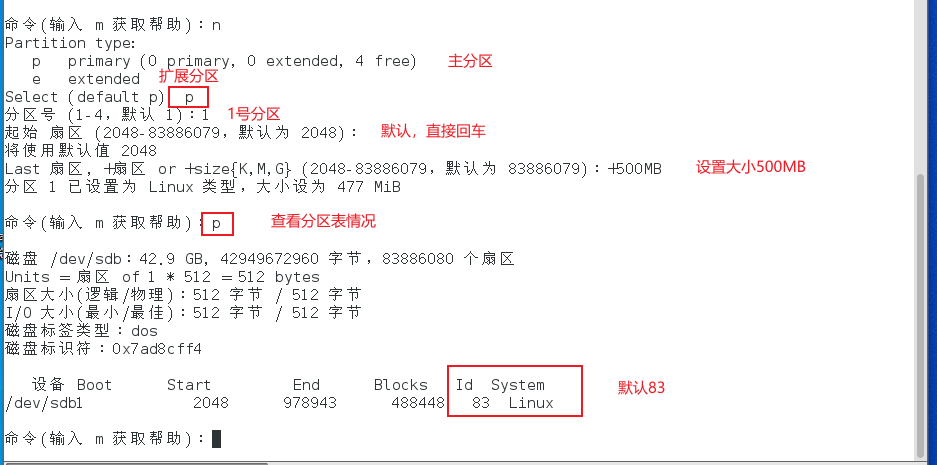
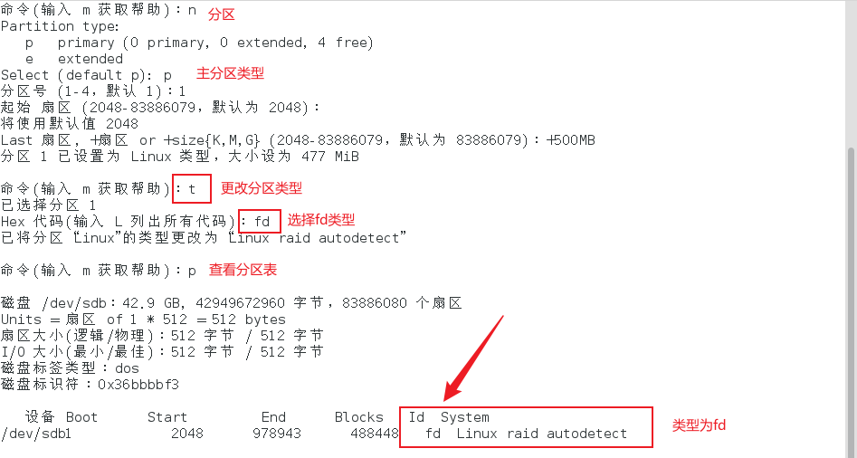
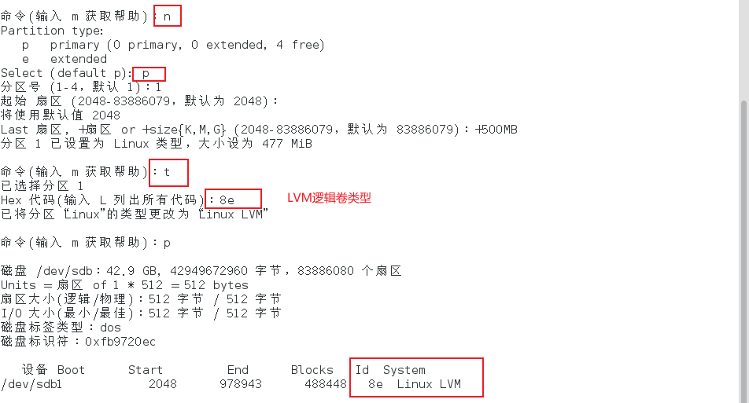
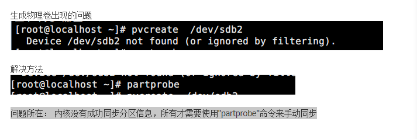

# Linux 网络操作系统

[toc]


## 项目一 安装与基本配置Linux操作系统


## 项目二 熟练使用Linux常用命令

### Linux命令的特点

在Linux系统中，命令区分大小写。在命令行中，可以使用“Tab”键来自动补齐命令。利用向上或向下的光标键，可以翻查曾经执行过的历史命令，并可以再次执行。如果要在一个命令行上输入和执行多条命令，可以使用分号来分隔命令，如“cd /;ls”。断开一个长命令行，可以使用反斜杠“\”，可以将一个较长的命令分成多行表达，增强命令的可读性。执行后，shell自动显示提示符“>”，表示正在输入一个长命令，此时可继续在新行上输入命令的后续部分。

- 区分大小写，像ls和LS 是不一样的
- 自动补齐 例：history 历史命令记录 ，  clear 清除屏幕

- 向上或向下的键盘键，查找历史记录

- 使用分号来分隔命令执行多条命令 `cd /;ls`

- 以后台方式执行“&”符号  `find / -name httpd.conf &`

- 长命令行，可以使用反斜杠“\”
- 绝对路径 `cd /usr/local`
- 相对路径 `cd etc/`

超级用户和普通用户

### 浏览目录类命令

- pwd 查看当前所在位置，普通用户的家目录 /home/yy

- cd 切换目录

  `cd /usr/local/`

  `cd test`

  ` cd ..`  返回上级目录（文件夹）

  `cd ~` 返回家目录

- ls 浏览目录或文件

  - ls -a 显示隐藏文件
  - ls -l 长格式显示
  - ls -R 显示子目录或子文件

-  ll 长格式显示
### 浏览文件类命令
- cat  滚屏显示文件内容或是将多个文件合并成一个文件

  - -b：对输出内容中的非空行标注行号。 `cat -b /etc/aliases`
  - -n：对输出内容中的所有行标注行号。 `cat -n /etc/aliases`

  `cat /etc/aliases`

  `cat file2 file1>file3 `  如果原文件存在，则覆盖
  `cat file2 file1>>file3 `  如果原文件存在，则追加

- more 用于分屏显示文件内容

  `more /etc/passwd` 空格翻页，Q退出 ，回车是下一行，空格是下一页

- less 命令可以向下、向上翻页，甚至可以前后左右移动

  less httpd.conf

- tail -3 /etc/passwd 显示尾部几行

- head -3 /etc/passwd 显示头部几行

```bash
[yy@RHEL7-1 ~]$ tail -3 /etc/passwd
ntp:x:38:38::/etc/ntp:/sbin/nologin
tcpdump:x:72:72::/:/sbin/nologin
yy:x:1000:1000:yy:/home/yy:/bin/bash
[yy@RHEL7-1 ~]$ head -1 /etc/passwd
root:x:0:0:root:/root:/bin/bash
```


### 目录操作类命令

- mkdir -p test/test1/test2 递归创建目录 

```
test/
  `-- test1
      `-- test2
```

`mkdir test1`

- `rmdir -p test/test1/test2` 递归删除目录 

  `rmdir test/test1/test2`

  

### cp命令

- -a 所有状态

- -R 递归复制

```
.
├── a
├── dir1
│   ├── a
│   └── file1
├── file1

cp file1 dir1/
cp -R a dir1/
```


`.bashrc 隐藏文件`

`cp ~/.bashrc /tmp/bashre`

`cp -i ~/.bashrc /tmp/bashre`

`cp  -a /var/log/wtmp wtmp_2`

```bash
ll /var/log/wtmp
-rw-rw-r--. 1 root utmp 25344 9月  23 08:54 /var/log/wtmp

cp /var/log/wtmp test1/wtmp_1
ll
-rw-rw-r--. 1 yy yy 25344 9月  23 09:52 wtmp_1

cp -a /var/log/wtmp ../test1/wtmp_2
-rw-rw-r--. 1 root utmp 25344 9月  23 08:54 wtmp_2
```


### 文件操作类命令

- mv 移动或改名
  - `mv test/file2 test1`  移动,后面跟目录是移动
  - `mv test1/file2 test1/file22222`  改名，后面跟文件名是改名
- rm  `rm -rf test2` `rm -ri test3/`
  - -i 提示
  - -f 不提示
  - -r 递归或者删除目录
- touch 命令用于建立文件或更新文件的修改日期
  - `touch aa`  新建文件
  - `touch -d 20180808 aa` 修改指定的日期
- diff 比较两个文件的差别
- ln 链接 
  - 硬链接
  - 软链接 -s  `ln -s a c`
- tar -czvf 压缩 `tar -czvf test.tar.gz a b c`
- tar -xzvf 解压 `tar -xzvf test.tar.gz`
- rpm 安装文件命令
  - `rpm -qa | more` 显示系统安装的所有软件包列表
  - `rpm -q selinux-policy` 查询系统是否安装了selinux-policy
  - `rpm -ivh sudo-1.8.6p7-20.el7.x86_64.rpm`
  - `rpm -ivh quota-4.01-14.el7.x86_64.rpm`

- find 查找文件 

  - `find /etc -name "*.conf"`//在/etc/目录下查找文件名以“.conf”结尾的文件
  - `find  .  -type  f  -exec  ls  -l  {}  \;` //在当前目录下查找普通文件，并以长格形式显示

  find命令的匹配表达式主要有以下几种类型。
  -name filename：查找指定名称的文件。
  -type：查找指定类型的文件。文件类型有：b（块设备文件）、c（字符设备文件）、d（目录）、p（管道文件）、l（符号链接文件）、f（普通文件）。
  -exec command {} \;：对匹配指定条件的文件执行command命令。
  
- locate 更加强大的查找文件命令 `locate *.doc`

- grep  查找文件中包含有指定字符串的行

```
[root@RHEL7-1 yy]# grep -2 root /etc/passwd
root:x:0:0:root:/root:/bin/bash
bin:x:1:1:bin:/bin:/sbin/nologin
daemon:x:2:2:daemon:/sbin:/sbin/nologin
--
halt:x:7:0:halt:/sbin:/sbin/halt
mail:x:8:12:mail:/var/spool/mail:/sbin/nologin
operator:x:11:0:operator:/root:/sbin/nologin
games:x:12:100:games:/usr/games:/sbin/nologin
ftp:x:14:50:FTP User:/var/ftp:/sbin/nologin

```


### 系统信息类命令

- dmesg显示系统诊断信息、操作系统版本号、物理内存大小以及其他信息。
- df命令主要用来查看文件系统的各个分区的占用情况
- free命令主要用来查看系统内存，虚拟内存的大小及占用情况
- date命令可以用来查看系统当前的日期和时间

### 进程管理类命令

- ps 主要用于查看系统的进程 `ps -au`
- pidof  用于查询某个指定服务进程的PID值 `pidof sshd `
- kill
- killall命令用于终止某个指定名称的服务所对应的全部进程

`killall -9 bash`

- top命令可以实时监控进程的状况


### 其他常用命令

- clear命令用于清除字符终端屏幕内容
- uname命令用于显示系统信息 `uname -a`
- man命令用于列出命令的帮助手册
- history命令用于显示用户最近执行的命令，可以保留的历史命令数
- wget命令用于在终端中下载网络文件，
- reboot命令用于重新启动系统
- poweroff命令用于立即停止系统，并关闭电源


## 项目三 管理linux用户和组

 Linux操作系统是多用户多任务的操作系统，允许多个用户同时登录到系统，使用系统资源。用户账户是用户的身份标识。用户通过用户账户可以登录到系统，并且访问已经被授权的资源。系统依据账户来区分属于每个用户的文件、进程、任务，并给每个用户提供特定的工作环境（例如，用户的工作目录、shell版本以及图形化的环境配置等），使每个用户都能各自不受干扰地独立工作。

Linux系统下的用户账户分为两种：

- 普通用户账户：在系统中只能进行普通工作，只能访问他们拥有的或者有权限执行的文件。
- 超级用户账户（root）：也叫管理员账户，它的任务是对普通用户和整个系统进行管理。超级用户账户对系统具有绝对的控制权，能够对系统进行一切操作

 组群是具有相同特性的用户的逻辑集合，使用组群有利于系统管理员按照用户的特性组织和管理用户，提高工作效率。有了组群，在做资源授权时可以把权限赋予某个组群，组群中的成员即可自动获得这种权限。一个用户账户可以同时是多个组群的成员，其中某个组群是该用户的主组群（私有组群），其他组群为该用户的附属组群（标准组群）。



### 理解用户和组群配置文件

帐户文件 

- /etc/passwd文件

`root:x:0:0:root:/root:/bin/bash`

`用户名：加密口令：UID:GID：用户描述信息：主目录：命令解释器`

密码文件 

- /etc/shadow文件

` root:$6$lq4Er2YLAtrM2zqJ$fPf7i1L359e9JRqYT2H9iFJBx37/ZnO1RtFmvEy720XpLkfOOcclM.JJwFnAkzu50B6W2E/1.8Mw420naJfM00:18281:0:99999:7:::`


组群文件

- /etc/group文件

`yy:x:500:`

组群名称：口令：GID：成员列表

组群口令文件

- /etc/gshadow文件

  `yy:!!::`
  
  组群名称:加密后的组群口令（没有就用！）:组群的管理员:组群成员列表

默认选项文件

- /etc/login.defs文件



### 管理用户帐户

- 新建用户

```bash
[root@RHEL7-1 yy]# useradd user1
[root@RHEL7-1 yy]# useradd user2
[root@RHEL7-1 yy]# tail -3 /etc/passwd
yy:x:1000:1000:yy:/home/yy:/bin/bash
user1:x:1001:1001::/home/user1:/bin/bash
user2:x:1002:1002::/home/user2:/bin/bash
```



【例3-1】新建用户user3，UID为1010，指定其所属的私有组为group1（group1组的标识符为1010），用户的主目录为/home/user3，用户的shell为/bin/bash，用户的密码为123456，账户永不过期。

```shell
[root@RHEL7-1 ~]# groupadd -g 1010  group1 
[root@RHEL7-1 ~]# useradd -u 1010 -g 1010  -d /home/user3 -s /bin/bash -p 123456 -f -1 user3
[root@RHEL7-1 ~]# tail -1 /etc/passwd
user3:x:1010:1000::/home/user3:/bin/bash

```


- 设置密码


【例3-2】假设当前用户为root，则下面的两个命令分别为root用户修改自己的口令和root用户修改user1用户的口令。

`passwd`  设置超级用户密码

`passwd user1`  设置普通用户密码

```bash
[root@RHEL7-1 yy]# tail -1 /etc/shadow
user3:123456:19265:0:99999:7:::
[root@RHEL7-1 yy]# passwd user3
更改用户 user3 的密码 。
新的 密码：
无效的密码： 密码少于 8 个字符
重新输入新的 密码：
passwd：所有的身份验证令牌已经成功更新。
[root@RHEL7-1 yy]# tail -1 /etc/shadow
user3:$6$TUkWQKUv$1fLtX09co.Cqpn2QVBTOXjacebzd1Gw.6WRBGX2a9eANRh6r7YkHOwhddWP5P.3VxblPIJUpwVT.pOVinSn5R1:19265:0:99999:7:::
```


- chage命令


```bash
[root@RHEL7-1 yy]# chage -l user3
最近一次密码修改时间					：9月 30, 2022
密码过期时间					：从不
密码失效时间					：从不
帐户过期时间						：从不 
两次改变密码之间相距的最小天数		：0
两次改变密码之间相距的最大天数		：99999
在密码过期之前警告的天数	：7
```

【例3-3】设置user3用户的最短口令存活期为6天，最长口令存活期为60天，口令到期前5天提醒用户修改口令。设置完成后查看各属性值。

`chage -m 6 -M 60 -W 5 user1`

```bash
[root@RHEL7-1 yy]# chage -l user3
最近一次密码修改时间					：9月 30, 2022
密码过期时间					：11月 29, 2022
密码失效时间					：从不
帐户过期时间						：从不 (注意是从1970.1.1开始算)
两次改变密码之间相距的最小天数		：6
两次改变密码之间相距的最大天数		：60
在密码过期之前警告的天数	：5
```

`chage -m 6 -M 60 -W 5 -I 3 -E 19365 user3`

```bash
[root@RHEL7-1 yy]# chage -l user3
最近一次密码修改时间					：9月 30, 2022
密码过期时间					：11月 29, 2022
密码失效时间					：12月 02, 2022
帐户过期时间						：1月 08, 2023
两次改变密码之间相距的最小天数		：6
两次改变密码之间相距的最大天数		：60
在密码过期之前警告的天数	：5
```


- usermod命令


```bash
[yy@RHEL7-1 ~]$ id user3
uid=1010(user3) gid=1010(group1) 组=1010(group1)
```


案例：将用户user3加入root用户组中，这样扩展组列表中会出现root用户组的字样，而基本组不会受到影响。

`usermod -G root user3`

用-u参数修改用户的UID为8888。

`usermod -u 8888 user3`

修改用户user3的主目录为/var/user3，把启动shell修改为/bin/tcsh。

`usermod -d /var/user3 -s /bin/tcsh user3`

```bash
[root@RHEL7-1 yy]# tail -1 /etc/passwd
user3:x:8888:1010::/var/user3:/bin/tcsh
```

- 禁用和恢复用户帐户－Passwd命令

1. passwd

`passwd -l user1`

`passwd -u user1`

```bash
[root@RHEL7-1 yy]# passwd -l user3
锁定用户 user3 的密码 。
passwd: 操作成功
[root@RHEL7-1 yy]# passwd -u user3
解锁用户 user3 的密码。
passwd: 操作成功
```

2. usermod

`usermod -L user3 ` 禁用帐户

`usermod -U user3` 解锁帐户

3. 直接修改用户账户配置文件

可将/etc/passwd文件或/etc/shadow文件中关于user1账户的passwd域的第一个字符前面加上一个“*”，达到禁用账户的目的，在需要恢复的时候只要删除字符“*”即可

- 删除用户

`userdel -r user2`

如果不加-r选项，userdel命令会在系统中所有与账户有关的文件中（例如/etc/passwd，/etc/shadow，/etc/group）将用户的信息全部删除。
如果加-r选项，则在删除用户账户的同时，还将用户主目录以及其下的所有文件和目录全部删除掉。另外，如果用户使用E-mail的话，同时也将/var/spool/mail目录下的用户文件删掉。

### 管理组群

- 新建组群

  `groupadd testgroup`

- 修改组群信息

`groupmod -g 2000 testgroup` 修改gid

`groupmod -n testgorup1 testgroup`   修改组名

- 删除组群

`groupdel testgorup1`

- 入组群

  `gpasswd -a user1 testgroup`
  
  `gpasswd -A user1 testgroup`   指定user1为管理员，tail /etc/gshadow
  
  `gpasswd -d user1 testgroup`  删除组内成员user1

课堂作业：

​		假设有user1,user2,user3,user4四个用户，请将他们添加到usergroup组群中，并将user2设置为管理员，最后将user4删除。

###  安装图形化用户管理界面

`yum  install  system-config-users  -y`

```bash
正在解决依赖关系
--> 正在检查事务
---> 软件包 system-config-users.noarch.0.1.3.5-5.el7_9 将被 安装
--> 正在处理依赖关系 system-config-users-docs，它被软件包 system-config-users-1.3.5-5.el7_9.noarch 需要
略。。。。
```

`system-config-users`  启动图形化用户管理界面



```
yum安装报睡眠错误的解决方法
可能是系统自动升级正在运行，yum在锁定状态中。
可以通过强制关掉yum进程：
rm -f /var/run/yum.pid
然后就可以使用yum了。
```


## 项目四 配置与管理文件系统

### 全面理解文件系统与目录

文件系统（File System）是磁盘上有特定格式的一片区域，操作系统利用文件系统保存和管理文件。

1. Ext3：是一款日志文件系统，能够在系统异常宕机时避免文件系统资料丢失，并能自动修复数据的不一致与错误。然而，当硬盘容量较大时，所需的修复时间也会很长，而且也不能百分之百地保证资料不会丢失。它会把整个磁盘的每个写入动作的细节都预先记录下来，以便在发生异常宕机后能回溯追踪到被中断的部分，然后尝试进行修复。
2. Ext4：Ext3的改进版本，作为RHEL 6系统中的默认文件管理系统，它支持的存储容量高达1EB（1EB=1 073 741 824GB），且能够有无限多的子目录。另外，Ext4文件系统能够批量分配block块，从而极大地提高了读写效率。
3. XFS：是一种高性能的日志文件系统，而且是RHEL 7中默认的文件管理系统。它的优势在发生意外宕机后显得尤其明显，即可以快速地恢复可能被破坏的文件，而且强大的日志功能只用花费极低的计算和存储性能。它最大可支持的存储容量为18EB，这几乎满足了所有需求。

日常在硬盘需要保存的数据实在太多了，因此Linux系统中有一个名为super block的“硬盘地图”。Linux只是把每个文件的权限与属性记录在inode中，而且每个文件占用一个独立的inode表格。该表格的大小默认为128字节，里面记录着如下信息。

- 该文件的访问权限（read、write、execute）。
- 该文件的所有者与所属组（owner、group）。
- 该文件的大小（size）。
- 该文件的创建或内容修改时间（ctime）。
- 该文件的最后一次访问时间（atime）。
- 该文件的修改时间（mtime）。
- 文件的特殊权限（SUID、SGID、SBIT）。
- 该文件的真实数据地址（point）。


Linux文件系统目录结构


理解绝对路径和相对路径

绝对路径：由根目录（/）开始写起的文件名或目录名称，如/home/dmtsai/basher。
相对路径：相对于目前路径的文件名写法，如./home/dmtsai或../../home/dmtsai/等。

绝对路径`vim /etc/passwd`

相对路径 `vim passwd`

 因为你目前在/home下，所以要回到上—层（../）之后，才能进入/var/log目录。特别注意两个特殊的目录。
．：代表当前的目录，也可以使用./来表示。
．．：代表上—层目录，也可以用../来代表。

### 理解文件和文件权限

文件是操作系统用来存储信息的基本结构，是一组信息的集合。文件通过文件名来唯一地标识。Linux中的文件名称最长可允许255个字符，这些字符可用A~Z、0~9、.、_、-等符号来表示。
       与其他操作系统相比，Linux没有“扩展名”的概念，也就是说文件的名称和该文件的种类并没有直接的关联。它的另一个特性是Linux文件名区分大小写。

在Linux中的每一个文件或目录都包含有访问权限，这些访问权限决定了谁能访问和如何访问这些文件和目录。通过设定权限可以从以下3种访问方式限制访问权限。

- 只允许用户自己访问。
- 允许一个预先指定的用户组中的用户访问。
- 允许系统中的任何用户访问。

`-rw-rw-r--. 1 yy yy 0 10月  9 09:43 a`


根据赋予权限的不同，3种不同的用户（所有者、用户组或其他用户）能够访问不同的目录或者文件。所有者是创建文件的用户，文件的所有者能够授予所在用户组的其他成员以及系统中除所属组之外的其他用户的文件访问权限。 每一个用户针对系统中的所有文件都有它自身的读、写和执行权限。
    第一套权限控制访问自己的文件权限，即所有者权限。
    第二套权限控制用户组访问其中一个用户的文件的权限。
    第三套权限控制其他所有用户访问一个用户的文件的权限。
        这三套权限赋予用户不同类型（即所有者、用户组和其他用户）的读、写及执行权限，就构成了一个有9种类型的权限组。

### 详解文件的各种属性信息

 `-  rwx  r--  r--. 文件类型权限`

第1组为文件类型权限

d: 表示一个目录。在ext3中，目录是一种特殊的文件

-: 表示一个普通文件

l: 表示符号链接文件，实际上它指向另一个文件

b、c:分别代表区块主设备和其他的外围设备。是特殊类型的文件

s、p：这些文件关系到系统的数据结构和管道，通常很少见到。


下面举例说明。
brwxr--r--：该文件是块设备文件，文件所有者具有读、写与执行的权限，其他用户则具有读取的权限。
-rw-rw-r-x：该文件是普通文件，文件所有者与同组用户对文件具有读写的权限，而其他用户仅具有读取和执行的权限。
drwx--x--x：该文件是目录文件，目录所有者具有读写与进入目录的权限，其他用户能进入该目录，却无法读取任何数据。
lrwxrwxrwx：该文件是符号链接文件，文件所有者、同组用户和其他用户对该文件都具有读、写和执行权限。


### 使用数字表示法修改权限

所谓数字表示法是指将读取（r）、写入（w）和执行（x）分别以4、2、1来表示，没有授予的部分就表示为0，然后再把所授予的权限相加而成。

`chmod 666 b.txt`

### 使用文字表示法修改权限

-  u：user，表示所有者。

- g：group，表示属组。

- o：others，表示其它用户。

- a：all，表示以上三种用户。

操作权限：

读取（r）、写入（w）和执行（x）

操作符号：

- ＋：添加某种权限。

- -：减去某种权限。

- ＝：赋予给定权限并取消原来的权限。

添加权限：

`chmod u+x,g+wx,o+x a.txt`

取消权限：

`chmod a-x a.txt`

赋值权限：

`chmod o=wx c.txt`


> 作业：
> 新建文件c,观察文件权限，分别用数学和文字表示法修改权限
> 数字表示法 -rw-r--r--
> 文字表示法 -rwxrwxrwx

### 改变拥有者或组群 chown命令

修改所有者

`chown yy a.txt`

修改所组群

`chgrp yy a.txt `

同时修改所有者和组群

`chown root.root a.txt `

### 修改文件与目录的默认权限

查阅默认权限的方式有两种：
一是直接输入umask，可以看到数字形态的权限设定；    
二是加入-S（Symbolic）选项，则会以符号类型的方式显示权限。

root用户下执行：

umask 002

777-002=775

所得目录的权限是rwxrwxr-x

所得文件的权限是rw-rw-r--

思考：假设umask为003，在此情况下建立的文件与目录的权限又是怎样的呢？

umask为003，所以去掉的权限为- - - - - - - -wx，因此相关权限如下。
文件：(-rw-rw-rw-) -（--------wx）=-rw-rw-r--。
目录：(drwxrwxrwx) -（d-------wx）=drwxrwxr--。

**注意目录有X权限，文件是没有X权限的**

作业：

求在root用户的umask 222所得目录与文件权限

### 设置文件的隐藏属性

这项指令可改变存放在ext4文件系统上的文件或目录属性，这些属性共有以下8种模式。 
a：系统只允许在这个文件之后追加数据，不允许任何进程覆盖或截断这个文件。如果目录具有这个属性，系统将只允许在这个目录下建立和修改文件，而不允许删除任何文件。
b：不更新文件或目录的最后存取时间。 
c：将文件或目录压缩后存放。 
d：将文件或目录排除在倾倒操作之外。 
i：不得任意改动文件或目录。 
s：保密性删除文件或目录。 
S：即时更新文件或目录。 
u：预防意外删除。 

`chattr +i a` 添加隐藏属性

`lsattr`显示隐藏属性

```bash
[root@RHEL7-1 test]# touch a.txt
[root@RHEL7-1 test]# lsattr 
-------------e-- ./a.txt
[root@RHEL7-1 test]# chattr +i a.txt 
[root@RHEL7-1 test]# lsattr 
----i--------e-- ./a.txt
[root@RHEL7-1 test]# rm a.txt 
rm：是否删除普通空文件 "a.txt"？y
rm: 无法删除"a.txt": 不允许的操作
[root@RHEL7-1 test]# chattr -i a.txt 
[root@RHEL7-1 test]# lsattr 
-------------e-- ./a.txt
[root@RHEL7-1 test]# rm a.txt 
rm：是否删除普通空文件 "a.txt"？y
[root@RHEL7-1 test]# ll
总用量 0
[root@RHEL7-1 test]# 
```


### 设置文件特殊权限：SUID、SGID、SBIT

```
ls -ld /tmp/;ls -l /usr/bin/passwd 
drwxrwxrwt. 23 root root 4096 10月 16 08:49 /tmp/
-rwsr-xr-x. 1 root root 30768 2月  22 2012 /usr/bin/passwd
```

4为SUID，2为SGID，1为SBIT

`chmod 4755 a`

**SUID不能用在目录上，SBIT不能用在文件**

### 文件访问控制列表

如果希望对某个指定的用户进行单独的权限控制，就需要用到文件的访问控制列表（Access Control List，ACL）了。

为了更直观地看到ACL对文件权限控制的强大效果，可以先切换到普通用户，然后尝试进入root管理员的家目录中。在没有针对普通用户对root管理员的家目录设置ACL之前，其执行结果如下所示：

`setfacl -Rm u:yy:rwx /root`

案例：在yy用户状态下创建a.txt文件，使用user1用户查看读取权限，最后设置ACL取消user1的读权限。

yy 用户下新建文件a.txt

```
# file: a.txt
# owner: yy
# group: yy
user::rw-
group::rw-
other::r--
```


设置hi的文件访问控制列表

`setfacl -m u:user1:--- a ` 不给user1查看权限

`setfacl -m g:t:--- a`  不给组群t 读写执行权限

查看文件访问控制列表

`getfacl a`

```bash
# file: a.txt
# owner: yy
# group: yy
user::rw-
user:user1:---
group::rw-
mask::rw-
other::r--
```


测试

新建用户user1,并设置密码。是否有权限查看a.txt

实验步骤：

```bash
[yy@RHEL7-1 ~]$ mkdir test
[yy@RHEL7-1 ~]$ cd test/
[yy@RHEL7-1 test]$ vim a.txt
[yy@RHEL7-1 test]$ cat a.txt 
abcdef
[yy@RHEL7-1 test]$ ll
总用量 4
-rw-rw-r--. 1 yy yy 7 10月 14 16:58 a.txt
[yy@RHEL7-1 test]$ su
密码：
[root@RHEL7-1 test]# useradd user1
[root@RHEL7-1 test]# passwd user1
更改用户 user1 的密码 。
新的 密码：
无效的密码： 密码少于 8 个字符
重新输入新的 密码：
passwd：所有的身份验证令牌已经成功更新。
[root@RHEL7-1 test]# su user1
[user1@RHEL7-1 test]$ cat a.txt 
abcdef
[user1@RHEL7-1 test]$ su
密码：
[root@RHEL7-1 test]# setfacl -m u:user1:--- a.txt 
[root@RHEL7-1 test]# su user1
[user1@RHEL7-1 test]$ cat a.txt 
cat: a.txt: 权限不够
```

### 企业实战与应用

设系统中有两个账号，分别是alex与arod，这两个人除了自己群组之外还共同支持一个名为project的群组。假设这两个用户需要共同拥有/srv/ahome/目录的开发权，且该目录不许其他人进入查阅。请问该目录的权限应如何设定？请先以传统权限说明，再以SGID的功能解析。

## 项目五 配置与管理磁盘

### 熟练使用常用磁盘管理工具

> 思路：对一块新硬盘首先分区，其次格式化，最后挂载

- 查看磁盘设备 fdisk -l



Device Boot      Start         End      Blocks   Id  System

分区	 启动	起始柱面	终止柱面	总块数	分区ID	文件系统类型

- 磁盘命令规则 sda1    sdb2   sdc  sdd

#### 分区

- 分区命令 fdisk /dev/sdb


- n新建分区->p主分区(e扩展)->1主分区号->t更改类型->8e类型号->w保存

  ```
     Device Boot      Start         End      Blocks   Id  System
  /dev/sdb1               1          65      522081   83  Linux
  /dev/sdb2              66         130      522112+  8e  Linux LVM
  /dev/sdb3             131         386     2056320    5  Extended
  /dev/sdb5             131         195      522081   83  Linux
  /dev/sdb6             196         260      522081   83  Linux
  ```

  


**最后按w保存**

- d删除
- t更改类型

#### 格式化

`mkfs -t ext3 -V -c /dev/sdb1`

- -t指定要创建的文件系统类型

- -v 输出建立文件系统详细信
- -c 检查坏块

#### fsck命令

`fsck -a /dev/sdb1`

- -a如果检查中发现错误，则自动修复

#### mount与umount

- 提前是需要完成分区和格式化

- 新建目录 `mkdir /home/yy/test2`
- 挂载 ` mount /dev/sdb5 /home/yy/test2/`
- 修改权限 `chown yy.yy test2/`
- 卸载 `umount /dev/sdb1`

#### 文件系统的自动挂载

- `vim /etc/fstab `

  `/dev/sdb1       /home/yy/test2  ext3    defaults 0 0`
  
  `/dev/sdb1 /home/yy/test ext4 defaults 0 0`

#### 其它命令

- df 磁盘占用情况 `df -h`
- du 使用情况 `du -h`
- fsck 检查和修复
  - `fsck -a  /dev/sdb1`

### 磁盘配额管理

#### 准备工作

1. 分区`fdisk /dev/sdb`

2. ```
      Device Boot      Start         End      Blocks   Id  System
   /dev/sdb1               1          65      522081   83  Linux
   /dev/sdb2              66         130      522112+  83  Linux
   ```
   
3. 格式化 `mkfs -t ext4 -V -c /dev/sdb2`

4. 创建 /disk2目录 `mkdir /disk2`   (root模式)

5. `chmod 777 /disk2/`

6. 自动挂载 ` vim /etc/fstab `

7. ```bash
      /dev/sdb2       /disk2  ext4    defaults,usrquota,grpquota 0 0
      ```

      

####  创建quota配额文件

`setenforce 0`关闭安全机制

`quotacheck -cvug /dev/sdb2 -f -m`  创建记录文件

> quotacheck: Scanning /dev/sdb2 [/disk2] done  正常提示
> quotacheck: Checked 2 directories and 2 files

#### 设置用户和组群的磁盘配额

- 软限制  3个文件
- 硬限制  5个文件

1. 设置用户配额

`edquota -u yy `

-u 对用户进行配额管理

-g 对组群进行配额管理

-p 复制配额

```
Disk quotas for user yy (uid 500):
  Filesystem                   blocks       soft       hard     inodes     soft     hard
  /dev/sdb2                         0          0          0          0        3        5
```

2. 对/disk2目录更改用户和组群

`chown yy.yy /disk2/`

3. 启动磁盘配额

`quotaon -avug`

> /dev/sdb2 [/disk2]: group quotas turned on
> /dev/sdb2 [/disk2]: user quotas turned on  成功提示

4. yy用户身份对测试
5. 将yy的配额复制给user1 `edquota -p yy user1`
6. 对组建group1配额，useradd -g group1 user4设置用户主组群，用户的主组群必须是group1 `edquota -g group1`
7. 检查磁盘配额的使用情况`repquota -a`

### 磁盘配额配置企业案例

#### 环境需求

课本p100

#### 解决方案

1. 建立账号 `vim addaccount.sh`

```shell
#!/bin/bash
groupadd myquotagrp
for username in myquota1 myquota2 myquota3 myquota5
do
        useradd -g myquotagrp $username
        echo "password"|passwd --stdin $username
done
```
执行`sh addaccount.sh`文件

2. 启动系统的磁盘配额

- 分区` fdisk /dev/sdb`
- 格式化`mkfs -t ext3 -V -v /dev/sdb1`
- 挂载 `vim /etc/fstab`

`/dev/sdb1 /disk1 ext3 defaults,usrquota,grpquota 1 2`

`mkdir /disk1`

- 建立quota记录文件

`setenforce 0`

`quotacheck -cvug -mf /dev/sdb1`

- 启动磁盘配额

`quotaon -avug`

- 新建限制磁盘配额

`edquota -u myquota1`

```
Disk quotas for user myquota1 (uid 501):
  Filesystem                   blocks       soft       hard     inodes     soft     hard
  /dev/sdb1                         0     250000      300000          2        0        0
```


- 复制磁盘配额

`edquota -p myquota1 -u myquota2`

- 更改群组的磁盘限额

`edquota -g myquotagrp`

```
Disk quotas for group myquotagrp (gid 501):
  Filesystem                   blocks       soft       hard     inodes     soft     hard
  /dev/sdb1                         0     900000    1000000          4        0       0
```
- 更改宽限时间14天

`edquota -t`

```
Grace period before enforcing soft limits for users:
Time units may be: days, hours, minutes, or seconds
  Filesystem             Block grace period     Inode grace period
  /dev/sdb1                     14days                  7days

```

- 查看使用配额情况

`repquota -a 或 repquota /dev/sdb1`


### 在linux中配置软RAID

RAID（Redundant Array of Inexpensive Disks，独立磁盘冗余阵列）用于将多个廉价的小型磁盘驱动器合并成一个磁盘阵列，以提高存储性能和容错功能。**RAID可分为软RAID和硬RAID**。

RAID5：向阵列中的磁盘写数据，奇偶校验数据存放在阵列中的各个盘上，允许单个磁盘出错

#### 创建与挂载RAID设备

- 虚拟机创建四个新硬盘
- 分区`fdisk /dev/sdb`    n->p->1->回车->+500M->t->fd   **类型为fd** （暂时不需要格式化）



```bash
 Device Boot      Start         End      Blocks   Id  System
/dev/sdb1               1          65      522081   fd  Linux raid autodetect
```

- 使用mdadm命令创建RAID5

`mdadm --create /dev/md0 --level=5 --raid-devices=3 --spare-devices=1 /dev/sd[b-e]1`

磁盘阵列命令,设备名称md0,磁盘阵列5，三个主力盘，一个备用盘，设备名称[b-e]1

- 为新建立的/dev/md0建立文件系统（格式化）

`mkfs -t ext4 -V -c /dev/md0`

- 将RAID设备挂载

```
mkdir /media/md0
mount /dev/md0 /media/md0/
df
```

- 查看建立的RAID5的情况

`mdadm --detail /dev/md0`

```bash
    Number   Major   Minor   RaidDevice State
       0       8       17        0      active sync   /dev/sdb1
       1       8       33        1      active sync   /dev/sdc1
       4       8       49        2      active sync   /dev/sdd1

       3       8       65        -      spare   /dev/sde1
```


#### RAID5的数据恢复

- 将损坏的RAID成员标记为失效

`mdadm /dev/md0 --fail /dev/sdc1`

```bash
    Number   Major   Minor   RaidDevice State
       0       8       17        0      active sync   /dev/sdb1
       3       8       65        1      spare rebuilding   /dev/sde1
       4       8       49        2      active sync   /dev/sdd1

       1       8       33        -      faulty   /dev/sdc1
```

- 移除失效的RAID成员

`mdadm /dev/md0 --remove /dev/sdc1`

```bash
    Number   Major   Minor   RaidDevice State
       0       8       17        0      active sync   /dev/sdb1
       3       8       65        1      active sync   /dev/sde1
       4       8       49        2      active sync   /dev/sdd1
```

- 添加一个新的RAID成员

`mdadm /dev/md0 --add /dev/sdc1`

```bash
    Number   Major   Minor   RaidDevice State
       0       8       17        0      active sync   /dev/sdb1
       3       8       65        1      active sync   /dev/sde1
       4       8       49        2      active sync   /dev/sdd1

       5       8       33        -      spare   /dev/sdc1
```


### LVM逻辑卷管理

####  添加2块硬盘，sdb建立LVM类型的分区。（sdc暂时不分区）

`fdisk /dev/sdb`

`n>p>1>回车>+500M>t>8e`



```
   Device Boot      Start         End      Blocks   Id  System
/dev/sdb1               1          65      522081   8e  Linux LVM
/dev/sdb2              66         130      522112+  8e  Linux LVM
```

LVM流程：pv物理卷->vg卷组->lv逻辑卷

#### 建立物理卷

建立物理卷

`pvcreate /dev/sdb1`

查看物理卷

`pvdisplay`

物理卷信息

```
"/dev/sdb1" is a new physical volume of "509.84 MiB"
  --- NEW Physical volume ---
  PV Name               /dev/sdb1
  VG Name               
  PV Size               509.84 MiB
  Allocatable           NO
  PE Size               0   
  Total PE              0
  Free PE               0
  Allocated PE          0
  PV UUID               DYtu4Q-nFkN-3ppj-12jQ-zIBs-xYVh-ejERdp

```



#### 建立卷组

建立卷组

`vgcreate vg0 /dev/sdb1`

查看卷组信息

`vgdisplay `

卷组信息

```
--- Volume group ---
  VG Name               vg0
  System ID             
  Format                lvm2
  Metadata Areas        1
  Metadata Sequence No  1
  VG Access             read/write
  VG Status             resizable
  MAX LV                0
  Cur LV                0
  Open LV               0
  Max PV                0
  Cur PV                1
  Act PV                1
  VG Size               508.00 MiB
  PE Size               4.00 MiB
  Total PE              127
  Alloc PE / Size       0 / 0   
  Free  PE / Size       127 / 508.00 MiB
  VG UUID               MvfvjN-iHRF-oXkC-Y8qg-6YmG-1PlV-Dl4mng

```

#### 建立逻辑卷

建立逻辑卷

` lvcreate -L 20M -n lv0 vg0`

查看

`lvdisplay`

逻辑卷信息

```
--- Logical volume ---
  LV Path                /dev/vg0/lv0
  LV Name                lv0
  VG Name                vg0
  LV UUID                HA7mbe-f4A3-ifP5-NuI6-iXlW-nHto-oEmHEQ
  LV Write Access        read/write
  LV Creation host, time centos6.4-1, 2020-05-25 10:58:38 +0800
  LV Status              available
  # open                 0
  LV Size                20.00 MiB
  Current LE             5
  Segments               1
  Allocation             inherit
  Read ahead sectors     auto
  - currently set to     256
  Block device           253:0

```


#### 增加新的物理卷到卷组

`pvcreate /dev/sdb2`

`pvcreate /dev/sdc`  尝试把第三块硬盘变成物理卷

`vgextend vg0 /dev/sdb2`

`vgextend vg0 /dev/sdc` 尝试把第三块硬盘添加到vg0卷组

#### 逻辑卷容量的动态调整

添加容量

`lvextend -L +10M /dev/vg0/lv0`

减少容量

`lvreduce -L -5M /dev/vg0/lv0`

#### 删除逻辑卷\卷组\物理卷

删除流程：lv逻辑卷->vg卷组->pv物理卷

如果有挂载的请先卸载

`umount /dev/vg0/lv0`

删除逻辑卷

`lvremove /dev/vg0/lv0`

删除卷组

`vgremove vg0`

删除物理卷

`pvremove /dev/sdb[1-2]`

#### 逻辑卷格式化和挂载

`mkfs -t ext3 -V -c /dev/vg0/lv0`

` mkdir /media/lv0`

**挂载之前先格式化设备**

`mount /dev/vg0/lv0 /media/lv0/`

## 期中复习

1. 新建与安装Linux操作系统.(见书本p11)
2. 管理用户和组

- `useradd -d /home/user02 user02`
- `tail -3 /etc/passwd`
- `passwd user02`
- `groupadd group1`
- `gpasswd -a user02 group1`
- `tail -3 /etc/group`

3. 管理文件系统

- `su user01`
- `mkdir test;cd test`
- `touch file1;ll`
- `chmod o+w file1;ll ` 或 `chmod 666 file1;ll`
- `chmod g-r file1;ll`
- `chmod 755 file1;ll `

4. 管理磁盘

- `fdisk /dev/sdb`
- `n->p->1->回车->+500M`
- `n->e->2->回车->+10G`
- `n->l->回车->+500M`
- `w`
- `mkfs -t vfat -V -c /dev/sdb1`
- `mkfs -t ext3 -V -c /dev/sdb5`
- `fsck -a /dev/sdb1`
- `fsck -a /dev/sdb5`
- `mkdir /mnt/vfat;mkdir /mnt/ext3`
- `mount /dev/sdb1 /mnt/vfat/`
- `mount /dev/sdb5 /mnt/ext3/`

## 项目六 管理Linux服务器的网络配置

### 配置主机名

方法1

`hostnamectl status` 查看主机状态

`hostnamectl set-hostname my.smile.com`  修改主机名

方法2

` nmcli general hostname` 查看主机状态

`nmcli general hostname rhel` 修改主机名

方法3

`nmtui`

### 网络配置

1. Ip地址   `nmtui`

2. 子网掩码

3. 网关

4. DNS

5. 主机名 

   查看ip地址  `ip addr`

### 创建网络连接

`nmcli device status ` 查看设备状态（物理网卡）

`nmcli connection show`  查看连接（配置，逻辑网卡）

`nmcli connection add con-name eth0 type ethernet ifname ens33 `  添加一个名字叫eth0的连接，使用物理接口ens33

`nmcli connection modify eth0 ipv4.addresses 192.168.10.1/24 ipv4.gateway 192.168.10.1 ipv4.dns 192.168.10.1`  设置IP地址，子网掩码，网关和DNS

`nmcli connection modify eth0 -ipv4.dns 192.168.10.1`  删除DNS

`nmcli connection modify eth0 ipv4.method manual`  手动配置

`nmcli connection modify eth0 connection.autoconnect yes` 自动生效

`nmcli connection up eth0` 激活

`nmcli connection delete ens33`  删除连接

### 其它命令

`vim /etc/resolv.conf`  dns配置文件

`traceroute 192.168.10.2` 跟踪路由

`netstat` -an 查看端口

`netstat -an | grep :80 ` 查看80端口

### 配置SSH

服务器ip地址：192.168.10.1 主机名:server

客户机ip地址：192.168.10.2  主机名:client


`systemctl status sshd` 查看ssh是否安装

`firewall-cmd --list-all` 查看防火墙，默认ssh是放行的

`/etc/ssh` 密钥存放位置

#### 基于口令的验证—用账户和密码来验证登录

`ssh root@192.168.10.1`  ==> `yes`

禁用root管理员远程登录

`sudo vim /etc/ssh/sshd_config`

`PermitRootLogin no` 不允许root用户登录   esc-->shift+:-->wq

`systemctl restart sshd`  重启sshd服务

注意实验完成后恢复设置后重启 `#PermitRootLogin yes`

#### 基于密钥的验证

服务器上创建student帐号并设置密码

`ssh-keygen -t rsa` 生成密钥(在客户机上生成)

`/root/.ssh/id_rsa` 客户机存放密钥的位置

`/root/.ssh/id_rsa/known_hosts`  

`ssh-copy-id student@192.168.10.1` 将客户机的公钥上传到服务器

`ssh student@192.168.10.1` 以命令行登录服务器

`ssh -X student@192.168.10.1` 以图形化登录服务器

`/home/student/.ssh/authorized_keys` 服务器上存放客户机公钥的位置

#### 远程传输命令

上传

`scp a.txt 192.168.10.1:/home/yy` 使用密码登录

`scp a.txt student@192.168.10.1:/home/student` 使用密钥登录

`scp -r test/ 192.168.10.1:/home/yy` 上传文件夹

下载

`scp 192.168.10.1:/home/yy/b.txt /home/yy/`

#### 远程登录工具

- putty

---

###　Centos６的网络配置

### 常见网络配置文件

- `/etc/sysconfig/network`主机名，网关
- `/etc/sysconfig/network-scripts/ifcfg-eth0`  网卡
- `/etc/hosts`  早期静态域名解析
- `/etc/resolv.conf` 指定DNS服务器

- 配置主机名 

  - `hostname yesulin` 重启后失效
  - `vim /etc/sysconfig/network` 永久保存

  ```bash
  NETWORKING=yes
  HOSTNAME=yesulin
  ```

- 使用ifconfig配置IP地址（重启后失效）

`ifconfig` 查看网卡相关信息

`ifconfig eth0 192.168.0.168 netmask 255.255.255.0` 配置IP地址

`fconfig eth0:1 192.168.0.208 netmask 255.255.255.0` 配置虚拟网上IP地址

- 禁用和启用网卡
  - 方法1
    - `ifconfig eth0 down`禁用
    - `ifconfig eth0 up` 启用
  - 方法2
    - `ifdown eth0`禁用
    - `ifup eth0` 启用
- 使用route命令

`route add -net 192.168.1.0 netmask 255.255.255.0 gw 192.168.70.2 dev eth0`添加

`route del -net 192.168.3.0 netmask 255.255.255.0 gw 192.168.70.2 dev eth0`删除

- 配置物理地址(MAC)

`ifdown eth0` 首先禁用网卡

`ifconfig eth0 hw ether 00:11:22:33:44:55` 更改物理地址

- 网卡配置文件

`vim /etc/sysconfig/network-scripts/ifcfg-eth0 `

```bash
DEVICE=eth0
ONBOOT=yes
BOOTPROTO=static
IPADDR=192.168.1.1
NETMASK=255.255.225.0
DNS1=192.168.1.100
GATEWAY=192.168.1.254
```

案例：为上述eth0网卡再绑定一个IP地址192.168.1.3

`cd /etc/sysconfig/network-scripts/`

`cp ifcfg-eth0 ifcfg-eth0:1`

`vim ifcfg-eth0:1`

```bash
DEVICE=eth0:1
ONBOOT=yes
BOOTPROTO=static
IPADDR=192.168.1.3
NETMASK=255.255.255.0
DNS1=192.168.1.100
GATEWAY=192.168.1.254
HWADDR=00:0C:29:20:31:8B
```

注意：学生机如果出现错误可以尝试删除所有网上，uuidgen eth0,接着重新编辑配置文件

- 使用setup命令
- 使用service

`service network restart` 重启服务

`service 服务名 start/stop/status/restart/reload`

## 项目七 vim编程与调式

### 熟练使用vim编辑器

#### 启动与退出vim

- w 保存
- w filename 另存为
- wq!  保存并退出
- q! 不保存退出

#### vim的工作模式

- 编辑模式
  - h j k l 移动 
  - dd 删除（剪切）
  - yy 复制
  - p 粘贴
  - ctrl+f,ctrl+b 翻页
  - x （del）X 回格
  - G 最后一行  gg首行
  - u 撤消
  - ctrl+r 重做
  - /  查找 n往下查找 N往上查找
  
- 插入模式 i

- 命令模式 Esc->shift+:
  - :w 保存
  - :w! 强制保存
  - :wq 保存并退出
  - :q 退出
  - :q! 强制退出
  
  课堂练习：p140子任务4

### 命令运行的判断依据：;、&&、||

- cmd ; cmd（不考虑命令相关性的连续命令执行）。

`cd test;ll`

- $?（命令回传值）与“&&”或“||”。

  - $$

  `ls /tmp/abc && touch /tmp/abc/hehe`

  `ls: 无法访问/tmp/abc: 没有那个文件或目录`

  `mkdir abc`

  `ls /tmp/abc && touch /tmp/abc/hehe`

  - ||


### 正则表达式

正则表达式就是处理字符串的方法

`dmesg | grep 'IPv6'` 找出内含IPv6的行

- 查找特定字符串

`grep -n 'the' httpd.conf`  查找包含the的行

`grep -vn 'the' sample.txt ` 查找不包含the的行

`grep -in 'the' sample.txt ` 查找包含the的行(不区分开小写)

` grep -n 'oo' httpd.conf ` 查找所有包含oo的行

- 利用中括号 [] 来搜寻集合字符。不管[]里面有几个字符，都只代表一个

`grep -n 't[ae]st' sample.txt` 

`grep -n '[^g]oo' sample.txt `  不要g开头的且包括oo的单词

`grep -n '[0-9]' sample.txt` 显示包含有数学的行

- 行首与行尾字节^  $

`grep -n '^the' sample.txt ` 显示行首是the

`grep -n '^[a-z]' sample.txt` 行首是小写字母

`grep -n '^[^a-zA-Z]' sample.txt `  行首不要任何大小写字母的

`grep -n '\.$' sample.txt` 行尾不要是句号的，注意转义字符\

`grep -n '\!$' sample.txt `

`grep -n 'y$' sample.txt`

`grep -n '^$' sample.txt `  显示空白行

- 任意一个字符“.”与重复字节“*”

`grep -n 'g..d' sample.txt `

`grep -n 'gooo*' sample.tx`

`grep -n 'goo*g' sample.txt `

`grep -n '[0-9][0-9]*' sample.txt`

- 限定连续RE字符范围{}。

`grep -n 'go\{2,5\}' sample.txt`

`grep -n 'go\{2,5\}g' sample.txt ` 


`grep -n '[^R]oo' httpd.conf` 查找包含oo的行,并且排除R开头

`grep -n '[0-9]' httpd.conf` 查找包含数字的行

###  重定向

- 输入重定向 `wc</etc/passwd`
- 输出重定向 `ls -l  /tmp >dir`  `ls -l /etc >>dir` 追加

### 使用管道

`rpm -qa | grep samba`

管道符号告诉命令解释程序将左边的命令（在本例中为rpm -qa）的标准输出流连接到右边的命令（在本例中grep samba）的标准输入流。现在命令who的输出不经过临时文件就可以直接送到命令wc中了。

## 项目八 学习shell script

### 了解shell script

什么是shell script（程序化脚本）呢？就字面上的意义，我们将其分为两部分。在“shell”部分，我们在项目七中已经提过了，那是在命令行界面下让我们与系统沟通的一个工具接口。那么“script”是什么？字面上的意义，script是“脚本、剧本”的意思。整句话是说，shell script是针对shell所写的“脚本”。

1. 在shell script撰写中的注意事项

- 命令的执行是从上而下、从左而右进行的。
- 命令、选项与参数间的多个空格都会被忽略掉。
- 空 白行也将被忽略掉，并且按“Tab”键所生成的空白同样被视为空格键。
- 如果读取到一个Enter符号（CR），就尝试开始运行该行（或该串）命令。
- 如果一行的内容太多，则可以使用“\[Enter]”来延伸至下一行。
- “#”可作为注解。任何加在 # 后面的数据将全部被视为注解文字而被忽略。

2. 运行shell script程序
   现在我们假设程序文件名是 /home/dmtsai/shell.sh，那如何运行这个文件呢？很简单，可以有下面几个方法。

- 直接命令下达：shell.sh文件必须要具备可读与可运行（rx）的权限。
     绝对路径：使用 /home/dmtsai/shell.sh来下达命令。
     相对路径：假设工作目录在 /home/dmtsai/ ，则使用 ./shell.sh来运行。
     变量“PATH”功能：将shell.sh放在PATH指定的目录内，例如：~/bin/。

- 以bash程序来运行：通过“bash shell.sh”或“sh shell.sh”来运行。

     
  
  编写第一个shell script程序
  
  ```shell
  #!/bin/bash
  # Program:
  # This program shows "Hello World!" in your screen.
  # History:
  # 2018/08/23	Bobby	First release
  PATH=/bin:/sbin:/usr/bin:/usr/sbin:/usr/local/bin:/usr/local/sbin:~/bin
  export PATH
  echo -e "Hello World! \a \n"
  exit 0
  
  ```

### 养成撰写shell script的良好习惯

养成良好习惯是很重要的，但大家在刚开始撰写程序的时候，最容易忽略这部分，认为程序写出来就好了，其他的不重要。其实，如果程序的说明能够更清楚，那么对自己是有很大帮助的。
建议一定要养成良好的script撰写习惯，在每个script的文件头处包含如下内容。

- script的功能。
- script的版本信息。
- script的作者与联络方式。
- script的版权声明方式。
- script的History（历史记录）。

### 练习简单的shell script

```shell
#!/bin/bash
# Program:
#User inputs his first name and last name.  Program shows his full name.
# History:
# 2018/08/23	Bobby	First release
PATH=/bin:/sbin:/usr/bin:/usr/sbin:/usr/local/bin:/usr/local/sbin:~/bin
export PATH

read -p "Please input your first name: " firstname   	# 提示使用者输入
read -p "Please input your last name:  " lastname   	# 提示使用者输入
echo -e "\nYour full name is: $firstname $lastname"  	# 结果由屏幕输出
```

随日期变化：利用date进行文件的创建

```shell
#!/bin/bash
#源代码：
#利用日期进行文件的创建
#版本信息
# 2022.5.5  ysl v0.1
PATH=/bin:/sbin:/usr/bin:/usr/sbin:/usr/local/bin:/usr/local/sbin:~/bin
export PATH

#  让使用者输入文件名称，并取得fileuser这个变量；
echo -e "I will use 'touch' command to create 3 files." 	# 纯粹显示信息
read -p "Please input your filename: "  fileuser         	# 提示用户输入

#  为了避免用户随意按Enter键，利用变量功能分析文件名是否设置？
filename=${fileuser:-"filename"}         	# 开始判断是否设置了文件名

#  开始利用date命令来取得所需要的文件名
date1=$(date --date='2 days ago'  +%Y%m%d)	# 前两天的日期，注意+号前面有个空格
date2=$(date --date='1 days ago'  +%Y%m%d)	# 前一天的日期，注意+号前面有个空格
date3=$(date +%Y%m%d)                      	# 今天的日期
file1=${filename}${date1}                  	# 这三行设置文件名
file2=${filename}${date2}
file3=${filename}${date3}

#  创建文件
touch "$file1"                             
touch "$file2"
touch "$file3"
```

数值运算：简单的加减乘除

```shell
#!/bin/bash
# Program:
#User inputs 2 integer numbers; program will cross these two numbers.
# History:
# 2018/08/23	Bobby	First release
PATH=/bin:/sbin:/usr/bin:/usr/sbin:/usr/local/bin:/usr/local/sbin:~/bin
export PATH
echo -e "You SHOULD input 2 numbers, I will cross them! \n"
read -p "first number:  " firstnu
read -p "second number: " secnu
total=$(($firstnu*$secnu))
echo -e "\nThe result of $firstnu╳ $secnu is ==> $total"
```

### 了解脚本的运行方式的差异

- 利用直接运行的方式来运行脚本 `sh sh01.sh`
- 利用source运行脚本：在父程序中运行 `source sh01.sh `

### 用好判断式 test

`test -e sh01.sh && echo "exist" || echo "not exist"`

### 利用判断符号[]

`name="Bobby Yang"`

`[ "$name" == "Bobby" ] && echo "ok" || echo "no"`

`[ "$name" == "Bobby Yang" ] && echo "ok" || echo "no"`

### 使用条件判断式

####  利用if...then

```shell
#!/bin/bash
# Program:
#       This program shows the user's choice
# History:
# 2018/08/25    Bobby   First release
PATH=/bin:/sbin:/usr/bin:/usr/sbin:/usr/local/bin:/usr/local/sbin:~/bin
export PATH

read -p "Please input (Y/N): " yn

if [ "$yn" == "Y" ] || [ "$yn" == "y" ]; then
      echo "OK, continue"
      exit 0
fi
if [ "$yn" == "N" ] || [ "$yn" == "n" ]; then
      echo "Oh, interrupt!"
      exit 0
fi
echo "I don't know what your choice is" && exit 0

```


## 项目九 使用GCC

### 安装gcc

1. rpm 要解决依赖关系
2. yum 要配置本地源（网络源）

#### 配置yum本地源

`mkdir /iso`

`mount /dev/cdrom /iso`

`vim /etc/yum.repos.d/dvd.repo`

```
[dvd]
name=dvd
baseurl=file:///iso
gpgcheck=0
enabled=1            
```

cd /etc/yum.repos.d/  ，删除CentOS-Base.repo

>  测试安装是否成功

>  `yum list`

#### 使用yum安装gcc 

`yum install gcc`


### 程序：打印Hello World

```c
#include <stdio.h>
int main(){
	printf("hello world\n");
	return 0;
}
```

`gcc -c hello.c `  ===>`hello.o`目标文件===>`gcc -o hello.exe hello.o`执行文件

### 主程序、子程序链接、子程序的编译

```c
#include <stdio.h>
//主程序 thanks.c
int main(void){
        printf("hello world\n");
        thanks_2();
        }                          
```

```c
#include <stdio.h>
//子程序thanks_2.c
void thanks_2(void){
        printf("Thank you\n");
        }    
```

`gcc -c thanks.c thanks_2.c `  生成目标文件 thanks.o  thanks_2.o

`gcc -o thanks.exe thanks.o thanks_2.o` 生成可执行文件 thanks.exe

### 调用外部函数库

```c
#include <stdio.h>
int main(void){
        float value;
        value=sin(3.14/2);
        printf("%f\n",value);
        }     
```

`gcc sin.c -lm -L/lib -L/usr/lib`  提示错误，默认是启用

 ## 项目十 配置与管理Samba服务器（网络邻居）


### 安装samba服务

### Samba应用环境

- 文件和打印机共享：

- 身份验证和权限设置：

- 名称解析：

- 浏览服务：

### 了解SMB协议

SMB（Server Message Block）通信协议可以看作是局域网上共享文件和打印机的一种协议。它是Microsoft和Intel在1987年制定的协议，主要是作为Microsoft网络的通信协议，而Samba则是将SMB协议搬到UNIX系统上来使用。通过“NetBIOS over TCP/IP”，使用Samba不但能与局域网络主机共享资源，也能与全世界的计算机共享资源。因为互联网上千千万万的主机所使用的通信协议就是TCP/IP。SMB是在会话层和表示层以及小部分的应用层的协议，SMB使用了NetBIOS的应用程序接口API。
另外，它是一个开放性的协议，允许协议扩展，这使得它变得庞大而复杂，大约有65个最上层的作业，而每个作业都超过120个函数。

### 掌握Samba的工作原理

Samba服务功能强大，这与其通信基于SMB协议有关。SMB不仅提供目录和打印机共享，还支持认证、权限设置。在早期，SMB运行于NBT协议（NetBIOS over TCP/IP）上，使用UDP的137、138及TCP的139端口，后期SMB经过开发，可以直接运行于TCP/IP上，没有额外的NBT层，使用TCP的445端口。

- 协议协商。
- 建立连接
- 访问共享资源
- 断开连接

### 配置Samba服务

#### 安装并启动Samba服务

`yum install samba -y`   安装

`rpm -qa |grep samba`  查看安装成功后的信息

```
samba-4.4.4-9.el7.x86_64
samba-client-libs-4.4.4-9.el7.x86_64
samba-common-tools-4.4.4-9.el7.x86_64
samba-libs-4.4.4-9.el7.x86_64
samba-common-4.4.4-9.el7.noarch
samba-common-libs-4.4.4-9.el7.x86_64
```

`systemctl start smb`  启动

`systemctl enable smb `  开机启动

`systemctl restart smb` 重启123123

`systemctl stop smb` 停止

`systemctl reload smb` 重新载入

#### 了解Samba服务器配置的工作流程

1. 编辑主配置文件smb.conf，指定需要共享的目录，并为共享目录设置共享权限。
2. 在smb.conf文件中指定日志文件名称和存放路径。
3. 设置共享目录的本地系统权限。
4. 重新加载配置文件或重新启动SMB服务，使配置生效。
5. 关闭防火墙，同时设置SELinux为允许。

#### 主要配置文件smb.conf

samba的配置文件一般就放在/etc/samba目录中，主配置文件名为smb.conf。

RHEL7的smb.conf配置文件已经简化，只有36行左右。为了更清楚地了解配置文件建议研读smb.smf.example。samba开发组按照功能不同，对smb.conf文件进行了分段划分，条理非常清楚。

```shell
  1 # See smb.conf.example for a more detailed config file or
  2 # read the smb.conf manpage.
  3 # Run 'testparm' to verify the config is correct after
  4 # you modified it.
  5 
  6 [global]
  7         workgroup = SAMBA  # 工作组 507
  8         security = user  # 安全验证的方式 共有 4种 
  9 
 10         passdb backend = tdbsam # 定义用户后台的类型
 11 
 12         printing = cups
 13         printcap name = cups
 14         load printers = yes   #设置在Samba服务启动时是否共享打印机设备
 15         cups options = raw  #打印机的选项
 16 
 17 [homes]  # 用户主目录
 18         comment = Home Directories
 19         valid users = %S, %D%w%S
 20         browseable = No
 21         read only = No
 22         inherit acls = Yes
 23 
 24 [printers] # 共享打印机
 25         comment = All Printers
 26         path = /var/tmp
 27         printable = Yes
 28         create mask = 0600
 29         browseable = No
 30 
 31 [print$]
 32         comment = Printer Drivers
 33         path = /var/lib/samba/drivers
 34         write list = root
 35         create mask = 0664
 36         directory mask = 0775
 


```


【例10-1】samba服务器中有个目录为/share，需要发布该目录成为共享目录，定义共享名为ysl，要求：允许浏览、允许只读、允许匿名访问。设置如下所示。

步骤：

`mkdir /share`   在些目录下新建abc.txt 测试文件

`setenforce 0` 关闭安全机制

`firewall-cmd --permanent --add-service=samba` 防火墙放行samba

`firewall-cmd --reload`  重新加载防火墙

`firewall-cmd --list-all` 查看防火墙是否设置成功

`smbpasswd -a yy` 添加yy到samba帐号文件中

配置文件如下:

```shell
# See smb.conf.example for a more detailed config file or
# read the smb.conf manpage.
# Run 'testparm' to verify the config is correct after
# you modified it.

[global]
        workgroup = WORKGROUP
        security = user

        passdb backend = tdbsam

        printing = cups
        printcap name = cups
        load printers = yes
        cups options = raw

[homes]
        comment = Home Directories
        valid users = %S, %D%w%S
        browseable = No
        read only = No
        inherit acls = Yes

[printers]
        comment = All Printers
        path = /var/tmp
        printable = Yes
        create mask = 0600
        browseable = No

[print$]
        comment = Printer Drivers
        path = /var/lib/samba/drivers
        write list = root
        create mask = 0664
        directory mask = 0775

[ysl]
        comment = my home
        path = /share
        public = yes
        browseable = yes
        read only = yes

```

设置可以写入

`read only = no`

`systemctl restart smb`

` chmod 777 /share/`


### 任务3 user服务器实例解析

【例10-5】如果公司有多个部门，因工作需要，就必须分门别类地建立相应部门的目录。要求将销售部的资料存放在Samba服务器的/companydata/sales/目录下集中管理，以便销售人员浏览，并且该目录只允许销售部员工访问。
需求分析：在/companydata/sales/目录中存放有销售部的重要数据，为了保证其他部门无法查看其内容，我们需要将全局配置中security设置为user安全级别。这样就启用了Samba服务器的身份验证机制。然后在共享目录/companydata/sales下设置valid users字段，配置只允许销售部员工能够访问这个共享目录。

`mkdir /companydata`

`mkdir /companydata/sales`

`touch /companydata/sales/test.share.tar`

`groupadd sales`

`useradd -G sales sale1`

`useradd -G sales sale2`

`useradd test_user1`

`passwd sale1`

`passwd sale2`

`passwd test_user1`

`smbpasswd -a sale1`

`smbpasswd -a sale2`

`vim /etc/samba/smb.conf`

```bash
[sales]
        comment=hello
        path=/companydata/sales
        writable=yes
        browseable=yes
        valid users=@sales
```

`systemctl start smb`

`setenforce 0`

`firewall-cmd --permanent --add-service=samba`

`firewall-cmd --reload`

`chmod 770 /companydata/sales/ -R`

`chown root.sales /companydata/sales/ -R`

windows客户端测试

`\\192.168.10.1`

linux客户端测试

`yum install samba-client -y`

`smbclient  //192.168.10.1/sales -U sale2%123123`

`mkdir -p /mnt/sambadata`  挂载到本地

`mount -t cifs //192.168.10.1/sales /mnt/sambadata/ -o username=sale1 `挂载到本地

--------

### 以下是基于 Centos 6.4 的配置

------

yum install samba`

### 启动与停止samba服务

启动

`service smb start`

停止

`service smb stop`

重启

`service smb restart`

### 配置文件smb.conf

#### 匿名访问

`vim /etc/samba/smb.conf `

```
 74         workgroup = WORKGROUP
 75         server string = File server %v
101         security = share

配置文件后面另起一行写
289 [public]
290 comment=public
291 path=/share
292 guest ok=yes
293 public=yes
294 read only=no
```

新建目录并修改权限

`  mkdir /share`

`chmod 777 /share`

关闭安全机制和防火墙

`setenforce 0`

启动smb服务

`service smb start`

测试连接

方法1

`smbclient -L 目标ip地址`   不需要输入密码，直接回车

方法2

`mkdir -p /mnt/sambadata`

`mount -t cifs //目标ip地址/public /mnt/sambadata/`  不需要输入密码，直接回车


#### 用户名和密码访问

`vim /etc/samba/smb.conf `

```
101         security = user

296 [test1]
297 comment=test1 file
298 path=/test1
299 public=no
300 guest ok=no
301 read only=no
```

新建目录并修改权限

`mkdir /test1`

`chmod 777 /test1/`

添加用户账号和smb账号

`useradd test1
passwd test1
smbpasswd -a test1`

关闭安全机制和防火墙

`setenforce 0`

测试连接

方法1

`smbclient -L 172.16.128.193 -U test1%qwer1234` 

方法2

`mkdir /mnt/samtest1`

`mount -t cifs //172.16.128.193/test1 /mnt/samtest1/ -o username=test1%qwer1234`

## 项目十一 配置与管理DHCP服务器

```shell
ddns-update-style none;
log-facility local7;
        subnet 192.168.10.0 netmask 255.255.255.0 {
        range 192.168.10.30 192.168.10.40;
        option domain-name-servers 192.168.10.1;
        option domain-name "myDHCP.simile.com";
        option routers 192.168.10.254;
        option broadcast-address 192.168.10.255;
        default-lease-time 600;
        max-lease-time 7200;

}

host client{
        hardware ethernet 00:50:56:c0:00:01;
        fixed-address 192.168.10.35;
}
~     
```

`systemctl restart dhcpd` 重启 dhcpd


安装DHCP

`yum install dhcp -y`

配置文件路径

`vim /etc/dhcp/dhcpd.conf`

```bash
ddns-update-style none;
log-facility local7;
subnet 192.168.1.0 netmask 255.255.255.0{
        range 192.168.1.100 192.168.1.200;
        option domain-name-servers 192.168.1.1;
        option  routers 192.168.1.254;
        option broadcast-address 192.168.1.255;
        default-lease-time 600;
        max-lease-time 7200;
}

```

启动dhcp

`service dhcpd start`

保留地址配置应用

```bash
host CTO{
        hardware ethernet 00:0C:29:23:AC:AB;
        fixed-address 192.168.1.150;
}
```

错误解决办法

查找错误命令 `dhcpd`

```
编辑 /etc/rc.d/init.d/dhcpd 文件，将其中的
user=dhcpd
group=dhcpd
改为
user=root
group=root
```

删除文件

`rm /etc/yum.repos.d/CentOS-Base.repo`

DHCP服务器 192.168.1.1

其它固定服务器 192.168.1.2  192.168.1.30

地址池 192.168.1.100 192.168.1.200

service network restart 重启网卡


## 项目十二 配置与管理ＤＮＳ服务器

`yum install bind  -y`

### 全局配置文件

`vim /etc/named.conf`

```shell
options {
        listen-on port 53 { any; };
        listen-on-v6 port 53 { ::1; };
        directory       "/var/named";
        dump-file       "/var/named/data/cache_dump.db";
        statistics-file "/var/named/data/named_stats.txt";
        memstatistics-file "/var/named/data/named_mem_stats.txt";
        recursing-file  "/var/named/data/named.recursing";
        secroots-file   "/var/named/data/named.secroots";
        allow-query     { any; };

        /* 
         - If you are building an AUTHORITATIVE DNS server, do NOT enable recursion.
         - If you are building a RECURSIVE (caching) DNS server, you need to enable 
           recursion. 
         - If your recursive DNS server has a public IP address, you MUST enable access 
           control to limit queries to your legitimate users. Failing to do so will
           cause your server to become part of large scale DNS amplification 
           attacks. Implementing BCP38 within your network would greatly
           reduce such attack surface 
        */
        recursion yes;

        dnssec-enable yes;
        dnssec-validation no;

        /* Path to ISC DLV key */
        bindkeys-file "/etc/named.root.key";

        managed-keys-directory "/var/named/dynamic";

        pid-file "/run/named/named.pid";
        session-keyfile "/run/named/session.key";
};

logging {
        channel default_debug {
                file "data/named.run";
                severity dynamic;
        };
};

zone "." IN {
        type hint;
        file "named.ca";
};

include "/etc/named.zones";
include "/etc/named.root.key";


```

### 主配置文件

`vim /etc/named.zones`

```shell
zone "long.com" IN {
        type master;
        file "long.com.zone";
        allow-update {none;};
};

zone "10.168.192.in-addr.arpa" IN{
        type master;
        file "192.168.10.zone";
        allow-update {none;};
};

```

 ### 修改bind的区域配置文件

`cd /var/named/`  切换目录

#### 创建long.com.zone 正向区域文件

`cp -p named.localhost long.com.zone`

`vim long.com.zone`

```shell
$TTL 1D
@       IN SOA  @ root.long.com. (
                                        0       ; serial
                                        1D      ; refresh
                                        1H      ; retry
                                        1W      ; expire
                                        3H )    ; minimum
@       IN      NS      dns.long.com.
@       IN      MX      10      mail.long.com.

dns     IN      A       192.168.10.1
mail    IN      A       192.168.10.2
slave   IN      A       192.168.10.3
www     IN      A       192.168.10.4
ftp     IN      A       192.168.10.20
web     IN      CNAME   www.long.com.                                             

```

#### 创建192.168.10.zone反向区域文件

`cp -p named.loopback 192.168.10.zone`

`vim 192.168.10.zone`

```shell
$TTL 1D
@       IN SOA  @ root.long.com. (
                                        0       ; serial
                                        1D      ; refresh
                                        1H      ; retry
                                        1W      ; expire
                                        3H )    ; minimum
@       IN      NS      dns.long.com.
@       IN      MX      10 mail.long.com.

1       IN      PTR     dns.long.com.
2       IN      PTR     mail.long.com.
3       IN      PTR     slave.long.com.
4       IN      PTR     www.long.com.
20      IN      PTR     ftp.long.com.

```

### 防火墙设置和启动DNS

`firewall-cmd --permanent --add-service=dns`

`firewall-cmd --reload `

`firewall-cmd --list-all`

`setenforce 0`

`systemctl start named`

`systemctl status named.service ` 查看配置文件的错误

---

### 以下基于centos 6.4 的DNS配置

安装bind和bind-chroot

`yum install bind -y`

`yum install bind-chroot -y`

启动，停止，重启

`service named start`

`service named stop`

`service named restart`

#### named.conf全局配置文件

需要启动named服务才能出来全局配置文件

> `vim /var/named/chroot/etc/named.conf`

```bash
options {
        listen-on port 53 { any; };
        listen-on-v6 port 53 { ::1; };
        directory       "/var/named";
        dump-file       "/var/named/data/cache_dump.db";
        statistics-file "/var/named/data/named_stats.txt";
        memstatistics-file "/var/named/data/named_mem_stats.txt";
        allow-query     { any; };
        recursion yes;

        dnssec-enable yes;
        dnssec-validation yes;
        dnssec-lookaside auto;

        /* Path to ISC DLV key */
        bindkeys-file "/etc/named.iscdlv.key";

        managed-keys-directory "/var/named/dynamic";
};

logging {
        channel default_debug {
                file "data/named.run";
                severity dynamic;
        };
};

zone "." IN {
        type hint;
        file "named.ca";
};

include "/etc/named.zones";
include "/etc/named.root.key";
```

#### named.zones主配置文件

创建主配置文件

`cp -p named.rfc1912.zones named.zones`

> `vim /var/named/chroot/etc/named.zones`

```bash
zone "long.com" IN{
        type master;
        file "long.com.zone";
        allow-update {none;};
};

zone "168.192.in-addr.arpa" IN{
        type master;
        file "192.168.zone";
        allow-update{none;};
};
```

#### 创建long.com.zone正向区域文件

**请注意更换路径**

`cd /var/named/chroot/var/named/`

复制

`cp -p named.localhost long.com.zone`

`vim /var/named/chroot/var/named/long.com.zone`

```bash
$TTL 1D
@       IN SOA  @ rname.invalid. (
                                        0       ; serial
                                        1D      ; refresh
                                        1H      ; retry
                                        1W      ; expire
                                        3H )    ; minimum
@       IN      NS      dns.long.com.
@       IN      MX      10      mail.long.com.

dns     IN      A       192.168.1.2
mail    IN      A       192.168.0.3
slave   IN      A       192.168.1.4
www     IN      A       192.168.0.5
forward IN      A       192.168.0.6
computer        IN      A       192.168.22.98
ftp     IN      A       192.168.0.11
stu     IN      A       192.168.10.22
web     IN      CNAME   www.long.com.
```


#### 创建192.168.zone 反向区域文件

`cp -p named.loopback 192.168.zone`

`vim /var/named/chroot/var/named/192.168.zone `

```bash
$TTL 1D
@       IN SOA  @ rname.invalid. (
                                        0       ; serial
                                        1D      ; refresh
                                        1H      ; retry
                                        1W      ; expire
                                        3H )    ; minimum
@       IN      NS      dns.long.com.
@       IN      MX      10      mail.long.com.

2.1     IN      PTR     dns.long.com.
3.0     IN      PTR     mail.long.com.
4.1     IN      PTR     slave.long.com.
5.0     IN      PTR     www.long.com.
6.1     IN      PTR     forward.long.com.
98.22   IN      PTR     computer.long.com.
11.0    IN      PTR     ftp.long.com.
22.10   IN      PTR     stu.long.com.

```

#### 配置linux客户端和测试

`vim /etc/resolv.conf ` 配置客户端DNS服务的IP地址

```bash
search long.com
nameserver 192.168.1.1                      
```

测试命令

1. nslookup命令
2. dig www.long.com
3. host www.long.com

## 项目十三 配置与管理Apache服务器
### web服务的概述

### 安装、启动与停止Apache服务
`yum install httpd -y`
`systemctl start httpd`
`firewall-cmd --list-all` 查看防火墙
`firewall-cmd --permanent --add-service=http` 给http放行
`firewall-cmd --reload` 重载防火墙
`setenforce 0` 
`vim /etc/sysconfig/selinux` 永久禁用安全机制

```bash
SELINUX=0
```
`systemctl start httpd` 启动apache
`systemctl enable httpd` 设置开机自动启动
`firefox http://192.168.1.1`
`echo "Welcome to myweb">/var/www/html/index.html` 编辑简单测试页面，可以进入文件根目录操作

### 常规设置Apache服务器的实例

`cd /var/www/html/`

`vim index.html`

```html
<h1>
    Welcome....
</h1>
```


#### 设置文档根目录和首页文件的实例
`mkdir /home/www`
`echo "The web's documentroot test">/home/www/myweb.html`
`cd /etc/httpd/conf`
`cp -p httpd.conf httpd.conf.bak`
` vim httpd.conf`

```bash
119 DocumentRoot "/home/www"  # 文档根目录

124 <Directory "/home/www">   # 文档根目录权限
125     AllowOverride None
126     # Allow open access:
127     Require all granted
128 </Directory>

163 <IfModule dir_module>
164     DirectoryIndex index.html myweb.html  # 默认的索引页页面
165 #
166 # The following lines prevent .htaccess and .htpasswd files from being 
167 # viewed by Web clients. 
168 #
169 <Files ".ht*">
```
`systemctl restart httpd`
#### 用户个人主页实例
`useradd long`
`passwd long`
`chmod 705 /home/long/`
`mkdir /home/long/public_html`
`cd /home/long/public_html/`
`echo "this is long's web" > index.html`
`vim /etc/httpd/conf.d/userdir.conf ` 注意文件路径
```bash
 17 #    UserDir disabled
 24   UserDir public_html
```
`systemctl restart httpd`
#### 虚拟目录
`mkdir -p /virdir`
`echo "this is virtual directory sample" > /virdir/index.html`
`chmod 705 /virdir/index.html`
`vim /etc/httpd/conf/httpd.conf`
```bash
353 Alias /test "/virdir"
354 <Directory "/virdir">
355         AllowOverride None
356         Require all granted
357 </Directory>
```
`systemctl restart httpd`

### 其他常规设置
1. 根目录设置
`31 ServerRoot "/etc/httpd"`
2. 超时设置
`Timeout 300`
3. 客户端连接数限制
```bash
359 <IfModule prefork.c>
360         StartServers    8
361         MinSpareServers 5
362         MaxSpareServers 20
363         ServerLimit     500
364         MaxClients      500
365         MaxRequestSperChild     4000
366 </IfModule>
```
4. 设置管理员邮件地址
` 86 ServerAdmin root@localhost`
5. 设置主机名称
` 95 #ServerName www.example.com:80`
6. 网页编码设置
`314 AddDefaultCharset UTF-8`  
7. 目录设置
`DocumentRoot "/var/www/html"`
- 允许所有客户端访问
```bash
124 <Directory "/var/www/html">
125         Order allow,deny
126         Allow from all
127 </Directory>
```
- 拒绝IP地址为192.168.1.2和来自.bad.com域的客户端访问，其他客户端正常访问
```bash
124 <Directory "/var/www/html">
125         Order deny,allow
126         Deny from 192.168.1.2
127         Deny from .bad.com
128 </Directory>
```
- 仅允许192.168.1.0/24 网段的客户端访问，但其中192.168.1.3不能访问
```bash
124 <Directory "/var/www/html">
125         Order allow,deny
126         Allow from 192.168.1.0/24
127         Deny from 192.168.1.3
128 </Directory>
```
- 除了www.test.com的主机，允许其他所有人访问服务器
```bash
124 <Directory "/var/www/html">
125         Order allow,deny
126         Allow from all
127         Deny from www.test.com
128 </Directory>
```
- 只允许10.0.0.0/8 网段的主机访问服务器
```bash
124 <Directory "/var/www/html">
125         Order deny,allow
126         Allow from all
127         allow from 10.0.0.0/255.255.0.0
128 </Directory>
```
- 如果对某个文件做权限设置
```bash
<Files "/var/www/html/f1.txt">
        Order allow.deny
        Allow from all
</Files>
```
### 配置虚拟主机
#### 配置基于ip地址的虚拟主机
服务器一张网上共需要两个ip地址
`192.168.1.1`
`192.168.1.3`
`mkdir /var/www/ip1 /var/www/ip3`
`echo "this is 192.168.1.1's web" >/var/www/ip1/index.html`
`echo "this is 192.168.1.3's web" >/var/www/ip3/index.html`
`vim /etc/httpd/conf.d/vhost.conf`

```bash
<Virtualhost 192.168.1.1>
        DocumentRoot /var/www/ip1
</Virtualhost>

<Virtualhost 192.168.1.3>
        DocumentRoot /var/www/ip3
</Virtualhost>
```
`vim /etc/httpd/conf/httpd.conf`

```bash
<Directory "/var/www/ip1">
        AllowOverride None
        Require all granted
</Directory>
<Directory "/var/www/ip3">
        AllowOverride None
        Require all granted
</Directory>
```
`systemctl restart httpd`
#### 配置基于端口的虚拟主机
`mkdir /var/www/8088 /var/www/8089`
`echo "8088 port's web"> /var/www/8088/index.html`
`echo "8089 port's web"> /var/www/8089/index.html`
`vim /etc/httpd/conf/httpd.conf`

```bash
Listen 8088
Listen 8089
<Directory "/var/www">
        AllowOverride None
        Require all granted
</Directory>
```
`vim /etc/httpd/conf.d/vhost.conf`
```bash
<Virtualhost 192.168.1.1:8088>
        DocumentRoot /var/www/8088
</Virtualhost>
<Virtualhost 192.168.1.1:8089>
        DocumentRoot /var/www/8089
</Virtualhost>
```
`systemctl restart httpd`
`firewall-cmd --permanent --zone=public --add-port=8088/tcp` 注意防火墙设置
`firewall-cmd --permanent --zone=public --add-port=8089/tcp`
`firewall-cmd --reload `
`firewall-cmd --list-all`

#### 配置基于域名的虚拟主机
准备工作
`vim /etc/named.conf` 允许所有地址和端口进入
`vim /etc/named.zones`

```bash
zone "long.com" IN {
        type master;
        file "long.com.zone";
        allow-update {none;};

};

```
`cd /var/named`

`cp -p named.localhost long.com.zone`
`vim long.com.zone`

```bash
$TTL 1D
@       IN SOA  @ rname.invalid. (
                                        0       ; serial
                                        1D      ; refresh
                                        1H      ; retry
                                        1W      ; expire
                                        3H )    ; minimum

@       IN      NS      dns.long.com.
@       IN      MX      10      mail.long.com.

dns     IN      A       192.168.1.1
www1    IN      A       192.168.1.1
www2    IN      A       192.168.1.1
```
开启防火墙后，简单测试下DNS

`mkdir /var/www/www1 /var/www/www2`
`echo "www1.long.com's web"> /var/www/www1/index.html`
`echo "www2.long.com's web"> /var/www/www2/index.html`
`vim /etc/httpd/conf/httpd.conf`
```bash
Listen 80
<Directory "/var/www">
        AllowOverride None
        Require all granted
</Directory>
```
`vim /etc/httpd/conf.d/vhost.conf`
```bash
<Virtualhost 192.168.1.1>
        DocumentRoot /var/www/www1
        ServerName www1.long.com
</Virtualhost>
<Virtualhost 192.168.1.1>
        DocumentRoot /var/www/www2
        ServerName www2.long.com
</Virtualhost>
```
`systemctl restart httpd`

客户机修改
`vim /etc/hosts`
```bash
192.168.1.1 www1.long.com
192.168.1.1 www2.long.com
```
---
### 基于 Centos 6.4 的配置
### 常规设置Apache服务器

启动

`service httpd start`

配置文件地址

`vim /etc/httpd/conf/httpd.conf `

根目录

` 57 ServerRoot "/etc/httpd"`

超时设置

`70 Timeout 300`

最大用户数

```bash
 102 <IfModule prefork.c>
 103 StartServers       8
 104 MinSpareServers    5
 105 MaxSpareServers   20
 106 ServerLimit      500
 107 MaxClients       500
 108 MaxRequestsPerChild  4000
 109 </IfModule>
```

管理员邮箱

`262 ServerAdmin ysl@163.com`

域名

`275 ServerName www.example.com:80`

网页目录

` 292 DocumentRoot "/var/www/html"`

编码

`762 AddDefaultCharset UTF-8`

### 用户个人主页

新建用户和密码

`useradd ysl`

`passwd ysl`

修改家目录权限

`chmod 705 /home/ysl`

创建用户个人主页目录和网页

`mkdir /home/ysl/public_html`

`vim /home/ysl/public_html/index.html`

修改配置文件

禁用 ` 366  #UserDir disabled`

启用` 373    UserDir public_html`

```bash
 381 <Directory /home/*/public_html>
 382     AllowOverride FileInfo AuthConfig Limit
 383     Options MultiViews Indexes SymLinksIfOwnerMatch IncludesNoExec
 384     <Limit GET POST OPTIONS>
 385         Order allow,deny
 386         Allow from all
 387     </Limit>
 388     <LimitExcept GET POST OPTIONS>
 389         Order deny,allow
 390         Deny from all
 391     </LimitExcept>
 392 </Directory>
```

### 虚拟目录

`mkdir -p /virdir/`

`vim /virdir/index.html`

配置文件添加

` 411 Alias /test "/virdir"`

### 拒绝访问设置（基本网站）<Directory "/var/www/html">

拒绝IP地址为192.168.1.2访问

` 345      Order deny,allow
 346      Deny from 192.168.1.2`

拒绝192.168.11.2访问虚拟目录

` 412 <Directory "/virdir/>
 413         Order deny,allow
 414         Deny from 192.168.11.2 
 416 </Directory>`

### 配置虚拟主机

#### 基于IP地址的虚拟主机

添加一网卡多IP(临时)

`ifconfig eth0:1 192.168.11.11 netmask 255.255.255.0`

`ifconfig eth0:2 192.168.11.12 netmask 255.255.255.0`

新建目录和网页

`mkdir /var/www/ip1`

`mkdir /var/www/ip2`

`vim /var/www/ip1/index.html`

`vim /var/www/ip2/index.html`

配置文件

```bash
1014 <VirtualHost 192.168.11.11>
1015     ServerAdmin webmaster@dummy-host.example.com
1016     DocumentRoot /var/www/ip1
1017     ServerName dummy-host.example.com
1018     ErrorLog logs/dummy-host.example.com-error_log
1019     CustomLog logs/dummy-host.example.com-access_log common
1020 </VirtualHost>
1021 <VirtualHost 192.168.11.12>
1022     ServerAdmin webmaster@dummy-host.example.com
1023     DocumentRoot /var/www/ip2
1024     ServerName dummy-host.example.com
1025     ErrorLog logs/dummy-host.example.com-error_log
1026     CustomLog logs/dummy-host.example.com-access_log common
1027 </VirtualHost>
```

### 基于端口号的虚拟主机

新建目录和页面

`mkdir /var/www/port8080 /var/www/port8090`

`echo "this is 8080 ports web.">>/var/www/port8080/index.html`

`echo "this is 8090 ports web.">>/var/www/port8090/index.html`

配置文件

设置监听端口

`136 Listen 8080`

`137 Listen 8090`


```bash
<VirtualHost 192.168.11.1:8080>
    ServerAdmin webmaster@dummy-host.example.com
    DocumentRoot /var/www/port8080
    ServerName dummy-host.example.com
    ErrorLog logs/dummy-host.example.com-error_log
    CustomLog logs/dummy-host.example.com-access_log common
</VirtualHost>
<VirtualHost 192.168.11.1:8090>
    ServerAdmin webmaster@dummy-host.example.com
    DocumentRoot /var/www/port8090
    ServerName dummy-host.example.com
    ErrorLog logs/dummy-host.example.com-error_log
    CustomLog logs/dummy-host.example.com-access_log common
</VirtualHost>
```


## 项目十四 配置与管理FTP服务器
### 相关知识
### 项目设计与准备
FTP服务器：192.168.1.1
Linux客户端：192.168.1.2
windows客户端：192.168.1.3
### 项目实施
#### 安装、启动、防火墙
`yum install vsftpd -y`
`yum install ftp -y`
`systemctl start vsftpd`
`systemctl enable vsftpd`
`firewall-cmd --permanent --add-service=ftp`
`firewall-cmd --reload `
`setsebool -P ftpd_full_access=on`

#### 认识vsftpd的配置文件
`mv /etc/vsftpd/vsftpd.conf /etc/vsftpd/vsftpd.conf.bak`
`grep -v "#" /etc/vsftpd/vsftpd.conf.bak > /etc/vsftpd/vsftpd.conf`  参数-v列出和#不匹配的行
`cat /etc/vsftpd/vsftpd.conf -n`  查看清洗后的配置文件

```bash
     1	anonymous_enable=YES
     2	local_enable=YES
     3	write_enable=YES
     4	local_umask=022
     5	dirmessage_enable=YES
     6	xferlog_enable=YES
     7	connect_from_port_20=YES
     8	xferlog_std_format=YES
     9	listen=NO
    10	listen_ipv6=YES
    11	
    12	pam_service_name=vsftpd
    13	userlist_enable=YES
    14	tcp_wrappers=YES

```
#### 配置匿名用户ftp实例
`touch /var/ftp/pub/sample.tar`
`vim /etc/vsftpd/vsftpd.conf`

```bash
anonymous_enable=YES
local_enable=YES
write_enable=YES
local_umask=022
dirmessage_enable=YES
xferlog_enable=YES
connect_from_port_20=YES
xferlog_std_format=YES
listen=NO
listen_ipv6=YES

pam_service_name=vsftpd
userlist_enable=YES
tcp_wrappers=YES

anon_root=/var/ftp
#匿名用户的根目录
anon_upload_enable=YES
#允许上传
anon_mkdir_write_enable=YES
#允许新建目录
anon_other_write_enable=YES
#允许重命名，删除

```
`setenforce 0`
`systemctl restart vsftpd`
`ll -ld /var/ftp/pub`
`chown ftp /var/ftp/pub/`  修改目录的权限

```bash
drwxr-xr-x. 3 ftp root 4096 6月   6 09:35 /var/ftp/pub/
```
`systemctl restart vsftpd`

windows客户端：`ftp://192.168.1.1`
linux客户端：`ftp 192.168.1.1`

#### 配置本地模式的常规FTP服务器案例
`useradd -s /sbin/nologin team1`
`useradd -s /sbin/nologin team2`
`useradd -s /sbin/nologin user1`
`passwd team1`
`passwd team2`
`passwd user1`

`vim /etc/vsftpd/vsftpd.conf`

```bash
anonymous_enable=NO
local_enable=YES
local_root=/web/www/html
chroot_local_user=NO
chroot_list_enable=YES
chroot_list_file=/etc/vsftpd/chroot_list
allow_writeable_chroot=YES

write_enable=YES
local_umask=022
dirmessage_enable=YES
xferlog_enable=YES
connect_from_port_20=YES
xferlog_std_format=YES
listen=NO
listen_ipv6=YES

pam_service_name=vsftpd
userlist_enable=YES
tcp_wrappers=YES
```
`vim /etc/vsftpd/chroot_list`
```bash
team1
team2
```
`mkdir /web/www/html -p`
`touch /web/www/html/test.sample`
`ll -d /web/www/html/`
```bash
drwxr-xr-x. 2 root root 4096 6月   6 09:49 /web/www/html/
```
`chmod -R o+w /web/www/html/`

linux客户端：`ftp 192.168.1.1`
分别使用team1、team2和user1测试
user1是不能锁定在ftp目录下的，很危险

#### 创建vsftp虚拟账号
##### 创建用户数据库
创建用户文本文件
`mkdir /vftp`
`vim /vftp/vuser.txt`
```bash
user2
12345678
user3
12345678
```
生成数据库
`db_load -T -t hash -f /vftp/vuser.txt /vftp/vuser.db`
修改数据库文件访问权限
`chmod 700 /vftp/vuser.db `

##### 配置PAM文件 
`vim /etc/pam.d/vsftpd `
```bash
#%PAM-1.0
#session    optional     pam_keyinit.so    force revoke
#auth       required    pam_listfile.so item=user sense=deny file=/etc/vsftpd/ftpusers onerr=succeed
#auth       required    pam_shells.so
#auth       include     password-auth
#account    include     password-auth
#session    required     pam_loginuid.so
#session    include     password-auth
auth    required        pam_userdb.so   db=/vftp/vuser
account required        pam_userdb.so   db=/vftp/vuser
```
##### 创建虚拟账户对应系统用户
`useradd -d /var/ftp/vuser vuser`
`chown vuser.vuser /var/ftp/vuser`
`chmod 555 /var/ftp/vuser/`
`touch /var/ftp/vuser/test.vuser`
`ll -ld /var/ftp/vuser/`
```bash
dr-xr-xr-x. 3 vuser vuser 4096 6月   6 10:30 /var/ftp/vuser/
```
##### 修改/etc/vsftpd/vsftpd.conf
```bash
anonymous_enable=NO
anon_upload_enable=NO
anon_mkdir_write_enable=NO
anon_other_write_enable=NO
local_enable=YES
chroot_local_user=YES
allow_writeable_chroot=YES
write_enable=NO
guest_enable=YES
guest_username=vuser
listen=YES
pam_service_name=vsftpd
```
` systemctl restart vsftpd`

linux客户端：`ftp 192.168.1.1`
只能查看，不能更改目录和新建

#### 补充服务器端vsftp的主被动模式配置
略

---
### 基于Centos 6.4
安装vsftpd和ftp

`yum install vsftpd -y`

`yum install ftp -y`

启动ftp：

`service vsftpd start`

案例1：搭建一台ftp服务器，允许匿名用户上传和下载文件，匿名用户的根目录设置为/var/ftp

配置文件`vim /etc/vsftpd/vsftpd.conf`

` 12 anonymous_enable=YES
13 anon_root=/var/ftp`

` 28 anon_upload_enable=YES`

` 32 anon_mkdir_write_enable=YES`

修改目录权限

`ll -ld /var/ftp/pub/`

`chown ftp /var/ftp/pub/`

`chmod 777 /var/ftp/pub/`

关掉安全机制

`setenforce 0`

客户机测试连接

`ftp 192.168.11.1` 

默认用户是"ftp"

案例2：本地用户名和密码登录

`useradd -s /sbin/nologin team1`

`useradd -s /sbin/nologin team2`

`passwd team1`

`passwd team2`

配置文件

`12 anonymous_enable=no`

` 16 local_enable=YES`
 `17 local_root=/var/www/html`

`100 chroot_list_enable=YES`
`102 chroot_list_file=/etc/vsftpd/chroot_list`

配置允许用户列表

`vim /etc/vsftpd/chroot_list`

```bash
team1
team2
```


## 期末复习

1. 掌握虚拟机的启动，网络配置，本地源配置，保证两台机器物理能通。
2. 掌握服务器的配置，samba，dhcp,dns,ftp,apache等
3. 测试客户机能否正常访问服务器
4. 其它知识，如文件权限，新建目录，安装软件等。

### 基于centos 7.3

1. 使用桥接模式安装DHCP和DNS服务
2. nmtui 设置 ip 地址，子网掩码
3. `systemctl restart network` 重启网卡

#### 配置DHCP

`yum install dhcp -y`
`vim /etc/dhcp/dhcpd.conf`

```bash
ddns-update-style none;
log-facility local7;
subnet 192.168.1.0 netmask 255.255.255.01{
        range 192.168.1.30 192.168.1.150;
        option domain-name-servers 192.168.1.2;
        option domain-name "dns.jnrplinux.com";
        option routers 192.168.1.254;
        option subnet-mask 255.255.255.0;
        option broadcast-address 192.168.1.255;
        default-lease-time 600;
        max-lease-time 7200;
}

host webserver{
        hardware ethernet 00:0c:29:50:c4:4b;
        fixed-address 192.168.1.10;
}

host smbserver{
        hardware ethernet 11:22:33:44:55:66;
        fixed-address 192.168.1.5;
}


```

`systemctl start dhcpd`
`systemctl enable dhcpd`

客户机测试

#### 配置DNS

`yum install bind -y`

- 全局配置文件

`vim /etc/named.conf`

```bash
options {
        listen-on port 53 { any; };
        listen-on-v6 port 53 { ::1; };
        directory       "/var/named";
        dump-file       "/var/named/data/cache_dump.db";
        statistics-file "/var/named/data/named_stats.txt";
        memstatistics-file "/var/named/data/named_mem_stats.txt";
        recursing-file  "/var/named/data/named.recursing";
        secroots-file   "/var/named/data/named.secroots";
        allow-query     { any; };

        /* 
         - If you are building an AUTHORITATIVE DNS server, do NOT enable recursion.
         - If you are building a RECURSIVE (caching) DNS server, you need to enable 
           recursion. 
         - If your recursive DNS server has a public IP address, you MUST enable access 
           control to limit queries to your legitimate users. Failing to do so will
           cause your server to become part of large scale DNS amplification 
           attacks. Implementing BCP38 within your network would greatly
           reduce such attack surface 
        */
        recursion yes;

        dnssec-enable no;
        dnssec-validation no;

        /* Path to ISC DLV key */
        bindkeys-file "/etc/named.root.key";

        managed-keys-directory "/var/named/dynamic";

        pid-file "/run/named/named.pid";
        session-keyfile "/run/named/session.key";
};

logging {
        channel default_debug {
                file "data/named.run";
                severity dynamic;
        };
};

zone "." IN {
        type hint;
        file "named.ca";
};

include "/etc/named.zones";
include "/etc/named.root.key";

```

- 主配置文件

`vim /etc/named.zones`

```bash
zone "jnrplinux.com" IN {
        type master;
        file "jnrplinux.com.zone";
        allow-update {none;};
};

zone "1.168.192.in-addr.arpa" IN{
        type master;
        file "192.168.1.zone";
        allow-update {none;};
};
```

- 正向区域文件

`cd /var/named/`
`cp -p named.localhost jnrplinux.com.zone`
`vim jnrplinux.com.zone`

```bash
$TTL 1D
@       IN SOA  @ rname.invalid. (
                                        0       ; serial
                                        1D      ; refresh
                                        1H      ; retry
                                        1W      ; expire
                                        3H )    ; minimum

@       IN      NS      dns.jnrplinux.com.
@       IN      MX      10 mail.jnrplinux.com.

dns     IN      A       192.168.1.2
cw      IN      A       192.168.1.11
xs      IN      A       192.168.1.12
jl      IN      A       192.168.1.13
oa      IN      A       192.168.1.14
```

- 反向区域文件

`cp -p named.loopback 192.168.1.zone`
`vim 192.168.1.zone`

```bash
$TTL 1D
@       IN SOA  @ rname.invalid. (
                                        0       ; serial
                                        1D      ; refresh
                                        1H      ; retry
                                        1W      ; expire
                                        3H )    ; minimum

@       IN      NS      dns.jnrplinux.com.
@       IN      MX 10   mail.jnrplinux.com.

2       IN      PTR     dns.jnrplinux.com.
11      IN      PTR     cw.jnrplinux.com.
12      IN      PTR     xs.jnrplinux.com.
13      IN      PTR     jl.jnrplinux.com.
14      IN      PTR     oa.jnrplinux.com.
                                             
```

`setenforce 0`
`firewall-cmd --permanent --add-service=dns`
`firewall-cmd --reload`
`systemctl restart named`

客户机测试

`vim /etc/resolv.conf`

```bash
nameserver 192.168.1.2
```

三个测试工具

- nslookup  `dns.jnrplinux.com`
- dig  `dig jl.jnrplinux.com`
- host `host dns.jnrplinux.com`


---
### 基于centos 6.4
DHCP服务

```bash
#
# DHCP Server Configuration file.
#   see /usr/share/doc/dhcp*/dhcpd.conf.sample
#   see 'man 5 dhcpd.conf'
#
ddns-update-style none;
log-facility local7;
subnet 192.168.1.0 netmask 255.255.255.0{
	range 192.168.1.3   192.168.1.150;
	option domain-name-servers 192.168.1.3;
	option domain-name "dns.jnrp.cn";
	option routers 192.168.1.254;
	option subnet-mask 255.255.255.0;
	option broadcast-address 192.168.1.255;
	default-lease-time 600;
	max-lease-time 7200;
}

host webserver{
	hardware ethernet 12:34:56:78:AB:CD;
	fixed-address 192.168.1.10;
}

}
host smbserver{
	hardware ethernet 12:34:56:78:AB:FF;
	fixed-address 192.168.1.5;
}

```

DNS服务器

```bash
1.vim /var/named/chroot/etc/named.conf
----------------------------------------------------
options {
 11     listen-on port 53 { any; };
 12     listen-on-v6 port 53 { ::1; };
 13     directory   "/var/named";
 14     dump-file   "/var/named/data/cache_dump.db";
 15         statistics-file "/var/named/data/named_stats.txt";
 16         memstatistics-file "/var/named/data/named_mem_stats.txt";
 17     allow-query     { any; };
 18     recursion yes;
 19 
 20     dnssec-enable yes;
 21     dnssec-validation yes;
 22     dnssec-lookaside auto;
 23 
 24     /* Path to ISC DLV key */
 25     bindkeys-file "/etc/named.iscdlv.key";
 26 
 27     managed-keys-directory "/var/named/dynamic";
 28 };
 29 
 30 logging {
 31         channel default_debug {
 32                 file "data/named.run";
 33                 severity dynamic;
 34         };
 35 };
 36 
 37 zone "." IN {
 38     type hint;
 39     file "named.ca";
 40 };
 41 
 42 include "/etc/named.zones";
 43 include "/etc/named.root.key";
+++++++++++++++++++++++++++++++++++++++++++++++++++++
2.vim /var/named/chroot/etc/named.zones
------------------------------------------------------
 43 zone "jnrplinux.com" IN {
 44     type master;
 45     file "jnrplinux.com.zone";
 46     allow-update { none; };
 47 };
 48 
 49 zone "168.192.in-addr.arpa" IN {
 50     type master;
 51     file "192.168.zone";
 52     allow-update { none; };
 53 };
+++++++++++++++++++++++++++++++++++++++++++++++++
3.vim /var/named/chroot/var/named/jnrplinux.com.zone
---------------------------------------------------
  1 $TTL 1D
  2 @   IN SOA  @ rname.invalid. (
  3                     0   ; serial
  4                     1D  ; refresh
  5                     1H  ; retry
  6                     1W  ; expire
  7                     3H )    ; minimum
  8 @           IN  NS  dns.jnrplinux.com.
  9 @           IN  MX  10  mail.jnrplinux.com.
 10 
 11 dns         IN  A   192.168.1.2
 12 cw          IN  A   192.168.1.11
 13 xs          IN  A   192.168.1.12
 14 jl          IN  A   192.168.1.13
 15 oa          IN  A   192.168.1.14
++++++++++++++++++++++++++++++++++++++++++++++
4. vim /var/named/chroot/var/named/192.168.zone 
---------------------------------------------
  1 $TTL 1D
  2 @   IN SOA  @ rname.invalid. (
  3                     0   ; serial
  4                     1D  ; refresh
  5                     1H  ; retry
  6                     1W  ; expire
  7                     3H )    ; minimum
  8 @       IN  NS      dns.jnrplinux.com.
  9 @       IN  MX  10  mail.jnrplinux.com.
 10 
 11 2.1     IN  PTR     dns.jnrplinux.com.
 12 11.1    IN  PTR     cw.jnrplinux.com.
 13 12.1    IN  PTR     xs.jnrplinux.com.
 14 13.1    IN  PTR     jl.jnrplinux.com.
 15 14.1    IN  PTR     oa.jnrplinux.com.

```

